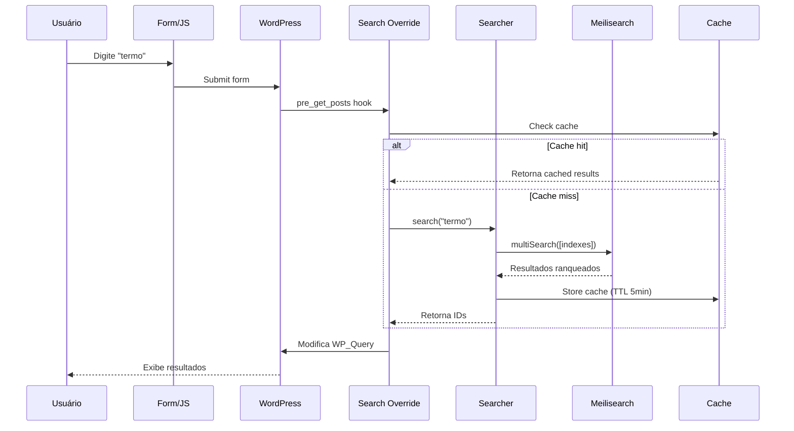

# 🔍 Sistema de Busca

Documentação detalhada do sistema de busca do plugin Meilisearch.

## Arquitetura de Busca



## Multi-Index Strategy

Cada site da rede tem seu próprio índice:

| Site | Blog ID | Index Name |
|------|---------|------------|
| Site Principal | 1 | `wp_1_posts` |
| Blog Noticias | 2 | `wp_2_posts` |
| Loja | 3 | `wp_3_posts` |

### Benefícios

- ✅ Isolamento de dados por site
- ✅ Fácil backup/restore individual
- ✅ Deletar site = deletar índice
- ✅ Configurações específicas por site

### Busca Multi-Index

```php
// Buscar em todos os índices simultaneamente
$client->multiSearch([
    ['indexUid' => 'wp_1_posts', 'q' => $query],
    ['indexUid' => 'wp_2_posts', 'q' => $query],
    ['indexUid' => 'wp_3_posts', 'q' => $query],
]);
```

## Relevância e Ranking

### Ranking Rules (Ordem de Aplicação)

1. **Words** - Quantidade de palavras encontradas
2. **Typo** - Tolerância a erros de digitação
3. **Proximity** - Proximidade dos termos buscados
4. **Attribute** - Posição no atributo (título > conteúdo)
5. **Sort** - Ordenação customizada
6. **Exactness** - Correspondência exata

### Searchable Attributes (Por Peso)

```php
[
    'title',      // Peso 100% (máximo)
    'excerpt',    // Peso 75%
    'content',    // Peso 50%
    'categories', // Peso 25%
    'tags',       // Peso 25%
    'author'      // Peso 10%
]
```

### Typo Tolerance

```php
'typoTolerance' => [
    'enabled' => true,
    'minWordSizeForTypos' => [
        'oneTypo' => 5,    // Aceita 1 erro em palavras 5+ letras
        'twoTypos' => 9    // Aceita 2 erros em palavras 9+ letras
    ]
]
```

**Exemplos**:

- `wordpress` → `wordpres` (1 typo) ✅
- `javascript` → `javscript` (1 typo) ✅
- `development` → `developmnt` (1 typo) ✅
- `word` → `wrod` (1 typo, mas menos de 5 letras) ❌

## Filtros e Facetas

### Filterable Attributes

Campos que podem ser filtrados:

```php
$results = $index->search('', [
    'q' => 'wordpress',
    'filter' => 'post_type = "post" AND date > 1609459200'
]);
```

Operadores:
- `=`, `!=` - Igualdade
- `>`, `<`, `>=`, `<=` - Comparação
- `AND`, `OR` - Lógicos
- `NOT` - Negação

### Exemplos de Filtros

```php
// Posts do tipo 'post'
'filter' => 'post_type = "post"'

// Posts de 2024
'filter' => 'date >= 1704067200 AND date < 1735689600'

// Posts por autor
'filter' => 'author_id = 3'

// Múltiplas categorias
'filter' => 'categories IN ["WordPress", "PHP"]'

// Combinar filtros
'filter' => 'post_type = "post" AND (categories = "Tech" OR tags = "tutorial")'
```

### Faceted Search

```php
$results = $index->search('wordpress', [
    'facets' => ['post_type', 'categories', 'author']
]);

// Resposta inclui distribuição
$results['facetDistribution'] = [
    'post_type' => [
        'post' => 120,
        'page' => 30
    ],
    'categories' => [
        'WordPress' => 80,
        'PHP' => 40,
        'JavaScript' => 30
    ]
];
```

## Sorting

### Sortable Attributes

```php
// Ordenar por data (mais recentes primeiro)
$results = $index->search('', [
    'sort' => ['date:desc']
]);

// Múltiplos critérios
$results = $index->search('', [
    'sort' => ['date:desc', 'title:asc']
]);
```

Campos ordenáveis:
- `date` - Data de publicação
- `modified` - Data de modificação
- `title` - Título (alfabético)

## Highlighting

Destacar termos encontrados:

```php
$results = $index->search('wordpress', [
    'attributesToHighlight' => ['title', 'excerpt'],
    'highlightPreTag' => '<mark>',
    'highlightPostTag' => '</mark>'
]);

// Resultado
[
    'title' => 'Guia completo de <mark>WordPress</mark>',
    'excerpt' => 'Aprenda <mark>WordPress</mark> do zero...'
]
```

## Paginação

```php
// Página 1 (10 resultados)
$results = $index->search('wordpress', [
    'limit' => 10,
    'offset' => 0
]);

// Página 2
$results = $index->search('wordpress', [
    'limit' => 10,
    'offset' => 10
]);

// Calcular páginas
$total_results = $results['estimatedTotalHits'];
$per_page = 10;
$total_pages = ceil($total_results / $per_page);
```

## Performance

### Caching

```php
// Cache automático via transients (5 min)
$cache_key = 'meilisearch_' . md5($query);
$cached = get_transient($cache_key);

if ($cached !== false) {
    return $cached;
}

$results = $searcher->search($query);
set_transient($cache_key, $results, 300);
```

### Otimizações

1. **Limitar campos retornados**:
```php
'attributesToRetrieve' => ['id', 'title', 'url']
```

2. **Desabilitar highlighting se não necessário**
3. **Usar paginação adequada** (10-20 resultados)
4. **Filtrar por post_type** quando possível

## Exemplos de Uso

### Busca Simples

```php
$client = new Meilisearch_Client($host, $key);
$searcher = new Meilisearch_Searcher($client);

$results = $searcher->search('wordpress', [
    'limit' => 10
]);

foreach ($results['hits'] as $hit) {
    echo $hit['title'];
}
```

### Busca com Filtros

```php
$results = $searcher->search('wordpress', [
    'filter' => 'post_type = "post" AND date > 1704067200',
    'sort' => ['date:desc'],
    'limit' => 20
]);
```

### Busca em Sites Específicos

```php
$results = $searcher->network_search('wordpress', [
    'blog_ids' => [1, 2],  // Apenas sites 1 e 2
    'limit' => 10
]);
```

---

**Veja também**:
- [Indexação](indexing.md)
- [Autocomplete](autocomplete.md)
- [API Reference](../api-reference.md)
