# 🏗️ Arquitetura do Sistema

Este documento descreve a arquitetura técnica do plugin Meilisearch Network Search, incluindo sua estrutura de componentes, fluxos de dados e padrões de design.

## Visão Geral da Arquitetura

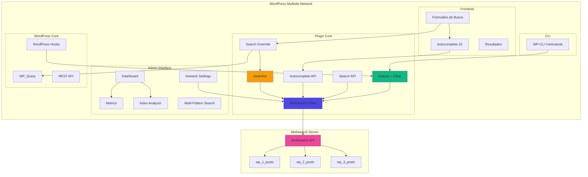

## Componentes Principais

### 1. Meilisearch Client (`includes/class-client.php`)

Wrapper do SDK oficial do Meilisearch PHP. Gerencia conexões e autenticação.

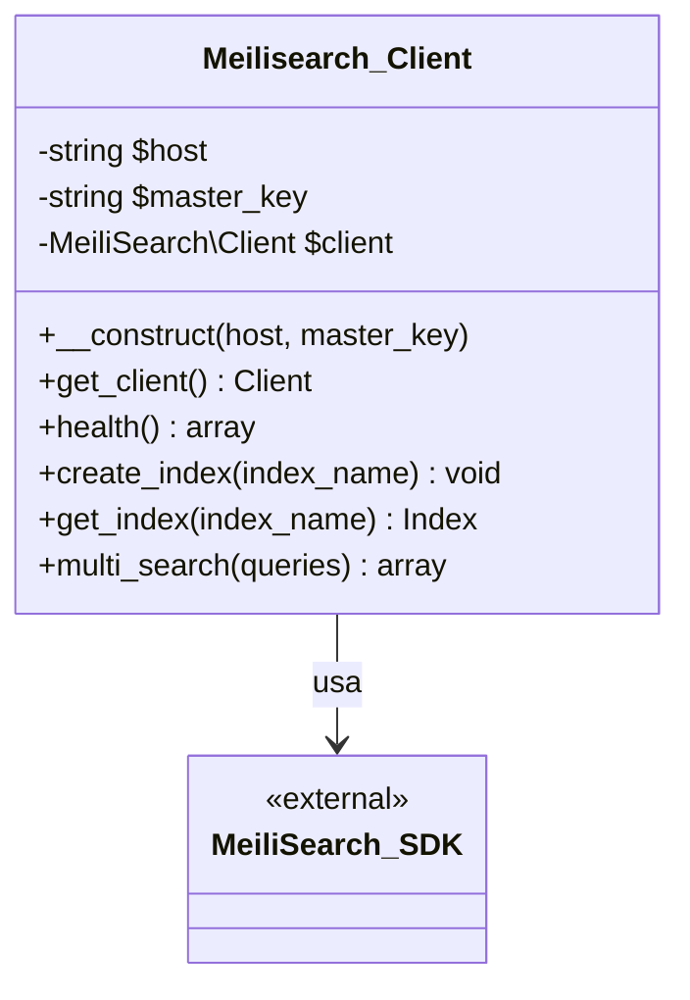

**Responsabilidades**:
- Estabelecer conexão com Meilisearch
- Validar credenciais (master key)
- Fornecer interface para outros componentes
- Tratar erros de conexão

### 2. Indexer (`includes/class-indexer.php`)

Gerencia a indexação de conteúdo usando PHP Fibers para operações concorrentes.

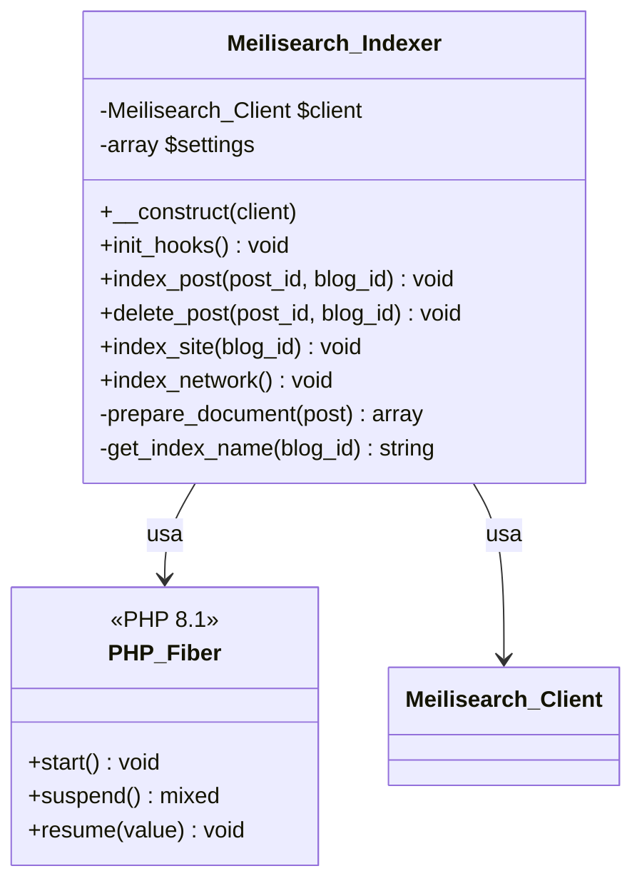

**Estratégia Multi-Index**: Cada site da rede tem seu próprio índice Meilisearch.

**Padrão de Nomenclatura**:
```
wp_{blog_id}_posts

Exemplos:
- Site ID 1: wp_1_posts
- Site ID 2: wp_2_posts
- Site ID 42: wp_42_posts
```

### 3. Searcher (`includes/class-searcher.php`)

Executa buscas multi-índice e retorna resultados combinados.

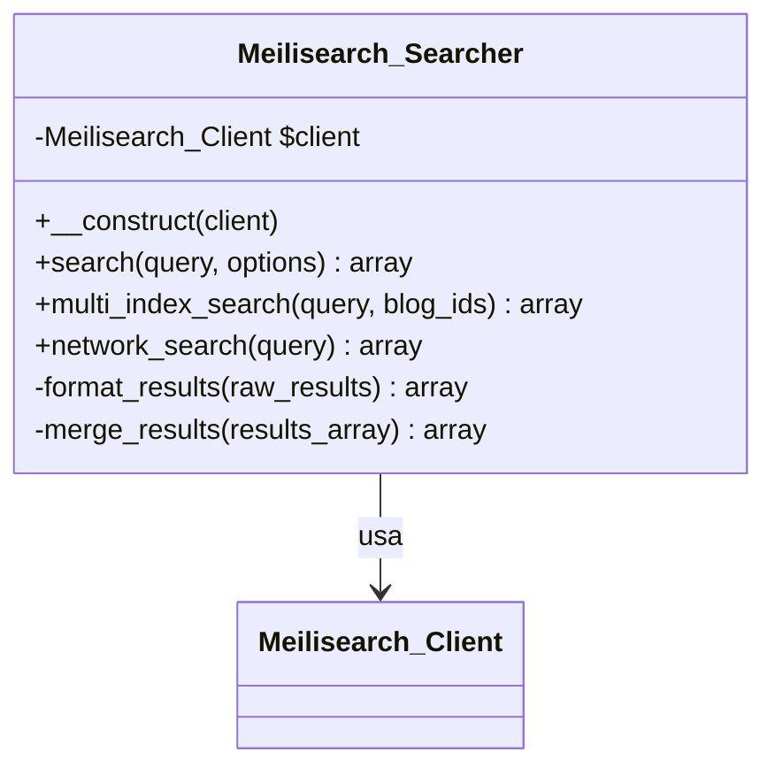

**Busca Multi-Índice**: Pesquisa em todos os índices da rede simultaneamente usando `multiSearch()` do Meilisearch.

### 4. Search Override (`public/class-search-override.php`)

Intercepta buscas do WordPress e substitui por Meilisearch.

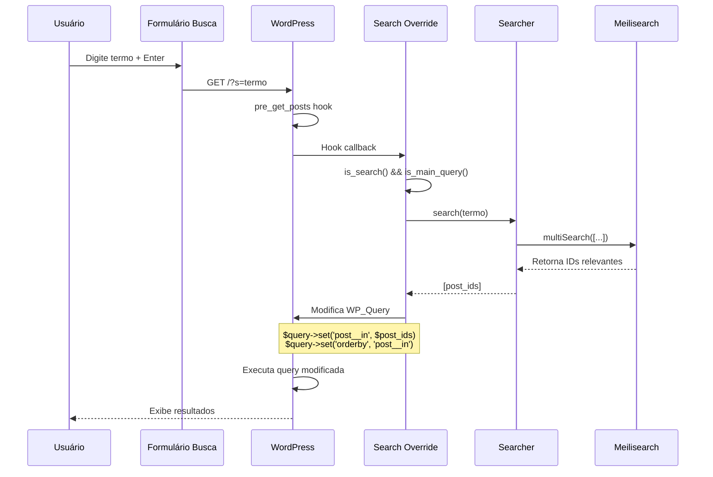

**Hook Principal**: `pre_get_posts` com prioridade 10.

### 5. Autocomplete (`includes/class-autocomplete.php`)

Fornece sugestões em tempo real via REST API.

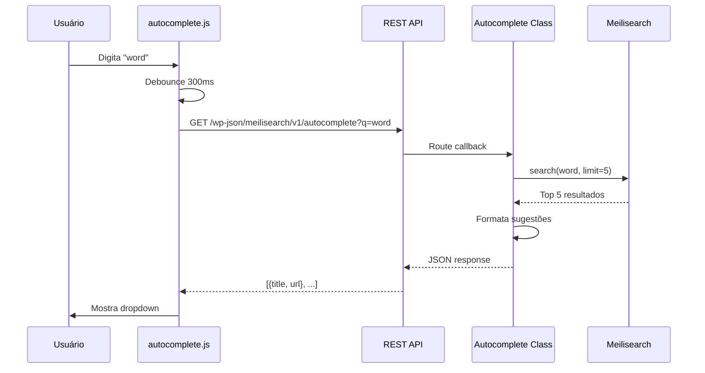

## Estratégia de Indexação

### Estrutura do Documento

Cada post indexado contém:

```json
{
  "id": "1_42",
  "blog_id": 1,
  "post_id": 42,
  "title": "Título do Post",
  "content": "Conteúdo completo...",
  "excerpt": "Resumo do post",
  "url": "https://site.com/post-slug",
  "author": "Nome do Autor",
  "author_id": 3,
  "post_type": "post",
  "post_status": "publish",
  "date": 1633024800,
  "modified": 1633024800,
  "categories": ["Categoria 1", "Categoria 2"],
  "tags": ["tag1", "tag2"],
  "site_name": "Nome do Site",
  "site_url": "https://site.com"
}
```

### Indexação Incremental

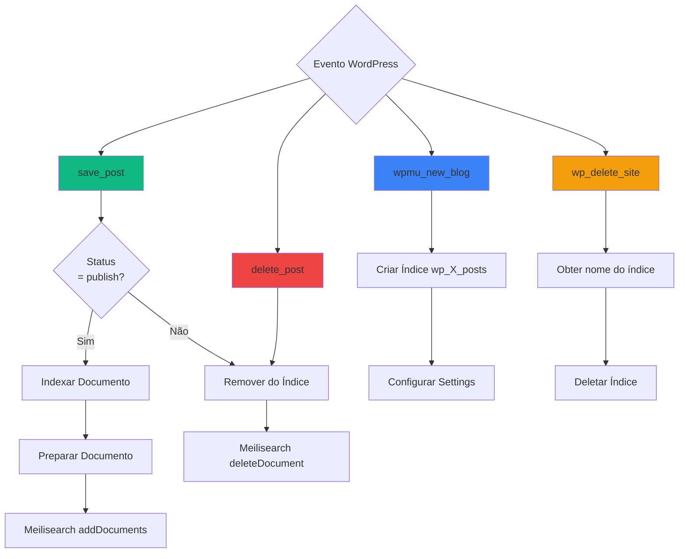

### Indexação em Massa (Fiber)

Para indexar toda a rede, o plugin usa PHP Fibers para processar múltiplos sites concorrentemente:

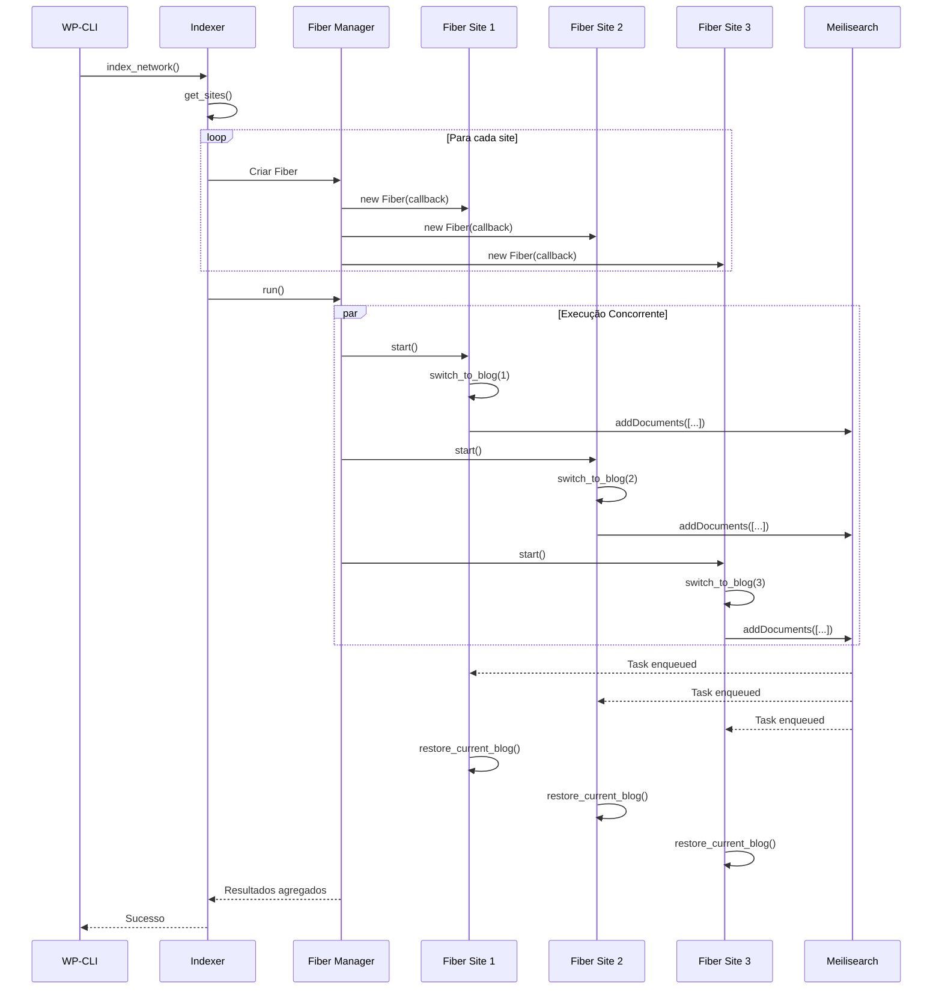

## Fluxo de Busca Completo

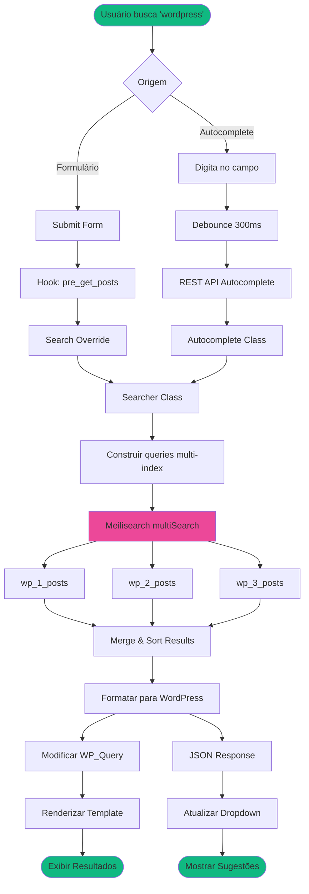

## Interface Administrativa

### Hierarquia de Menus

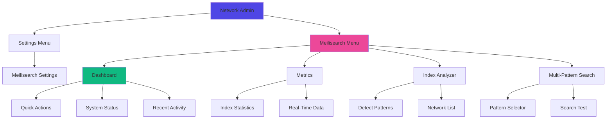

### Classes Admin

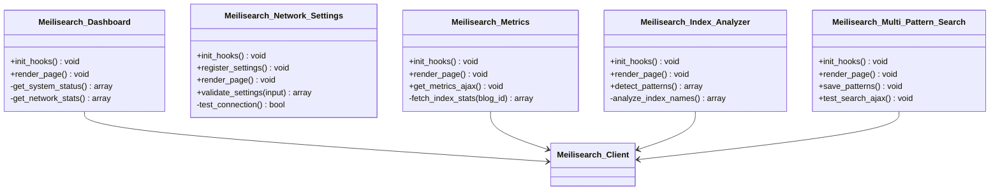

## Padrões de Design Utilizados

### 1. Singleton Pattern

Não usado diretamente, mas componentes são instanciados uma vez no bootstrap.

### 2. Dependency Injection

```php
// Client injetado no Indexer
$client = new Meilisearch_Client($host, $key);
$indexer = new Meilisearch_Indexer($client);
```

### 3. Hook-based Architecture

```php
class Meilisearch_Indexer {
    public function init_hooks() {
        add_action('save_post', [$this, 'index_post'], 10, 2);
        add_action('delete_post', [$this, 'delete_post']);
        add_action('wpmu_new_blog', [$this, 'new_blog_created']);
    }
}
```

### 4. Strategy Pattern

Diferentes estratégias de busca:
- `network_search()` - Busca em toda a rede
- `site_search()` - Busca em site específico
- `multi_pattern_search()` - Busca em múltiplas redes

## Fluxo de Dados

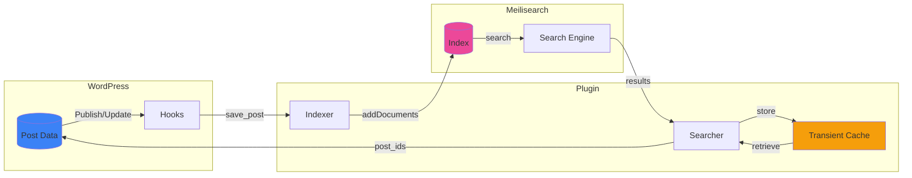

## Performance e Otimização

### Caching Strategy

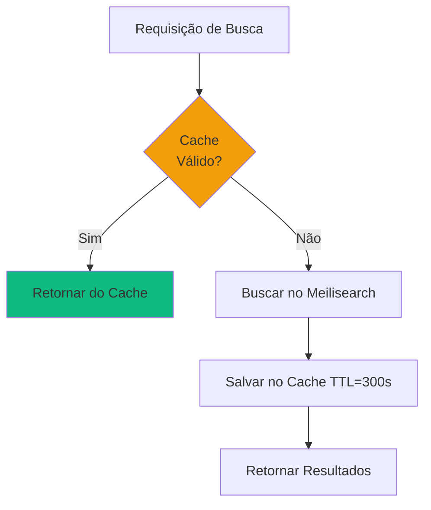

**Transient Keys**:
- `meilisearch_search_{md5($query)}` - Resultados de busca (5 min)
- `meilisearch_stats_{blog_id}` - Estatísticas do índice (5 min)

### Batch Processing

Indexação em lotes de 100 documentos por vez:

```php
$batch_size = 100;
$posts = get_posts(['numberposts' => -1]);
$batches = array_chunk($posts, $batch_size);

foreach ($batches as $batch) {
    $documents = array_map([$this, 'prepare_document'], $batch);
    $index->addDocuments($documents);
}
```

### Async Operations

ReactPHP para operações HTTP assíncronas:

```php
use React\EventLoop\Loop;
use React\Http\Browser;

$loop = Loop::get();
$browser = new Browser($loop);

// Múltiplas requisições HTTP paralelas
$promises = [];
foreach ($indexes as $index_name) {
    $promises[] = $browser->get("http://meilisearch:7700/indexes/$index_name/stats");
}

// Aguardar todas as respostas
Promise\all($promises)->then(function($responses) {
    // Processar todas as respostas
});

$loop->run();
```

## Segurança

### Validação de Entrada

```php
// Sanitização de query de busca
$search_query = sanitize_text_field($_GET['s']);

// Validação de blog_id
$blog_id = absint($_POST['blog_id']);

// Validação de master key
$master_key = sanitize_text_field($input['master_key']);
```

### Capability Checks

```php
// Apenas super admins podem acessar configurações
if (!current_user_can('manage_network_options')) {
    wp_die(__('Access denied', 'meilisearch'));
}
```

### Nonce Verification

```php
// AJAX requests
check_ajax_referer('meilisearch_ajax', 'nonce');

// Form submissions
wp_verify_nonce($_POST['_wpnonce'], 'meilisearch_settings');
```

## Tratamento de Erros

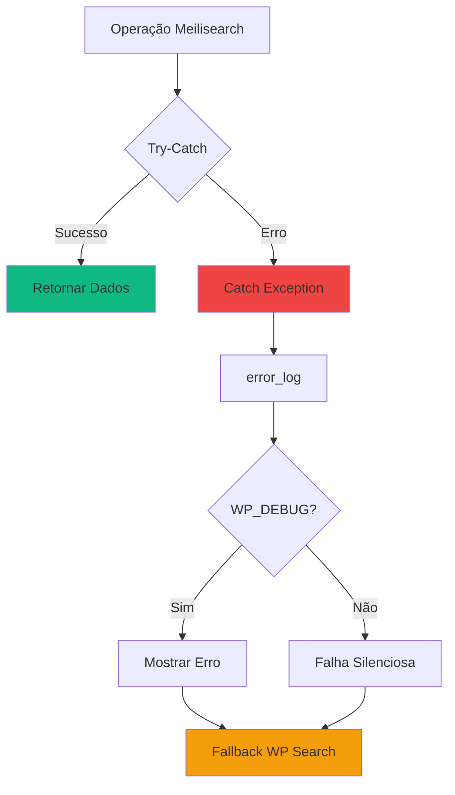

### Graceful Degradation

Se Meilisearch falhar, o plugin reverte para busca padrão do WordPress:

```php
try {
    $results = $searcher->search($query);
} catch (Exception $e) {
    error_log('Meilisearch error: ' . $e->getMessage());
    // Deixa WordPress executar busca padrão
    return;
}
```

## Estrutura de Arquivos

```
meilisearch/
├── meilisearch.php              # Bootstrap principal
├── includes/                     # Core classes
│   ├── class-client.php
│   ├── class-indexer.php
│   ├── class-searcher.php
│   ├── class-autocomplete.php
│   ├── class-search-api.php
│   └── class-cli.php
├── admin/                        # Network admin UI
│   ├── class-dashboard.php
│   ├── class-network-settings.php
│   ├── class-metrics.php
│   ├── class-index-analyzer.php
│   └── class-multi-pattern-search.php
├── public/                       # Frontend
│   └── class-search-override.php
├── assets/                       # Static assets
│   ├── js/
│   │   └── autocomplete.js
│   └── css/
│       └── autocomplete.css
├── languages/                    # i18n
├── vendor/                       # Composer dependencies
└── tests/                        # PHPUnit tests
```

## Próximos Passos

- [Configuração Detalhada](../primeiros-passos/configuration.md)
- [Guia do Desenvolvedor](../usage/developer-guide.md)
- [Referência da API](api-reference.md)
