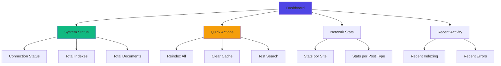
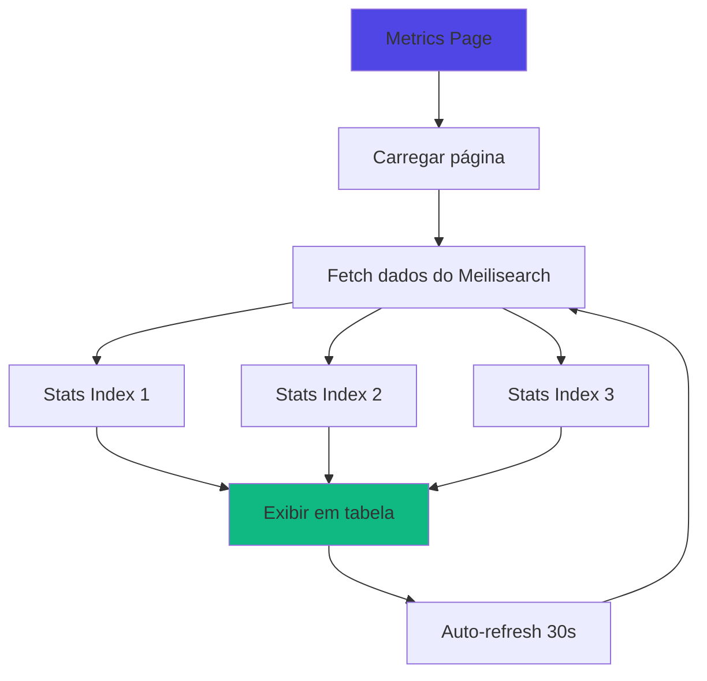
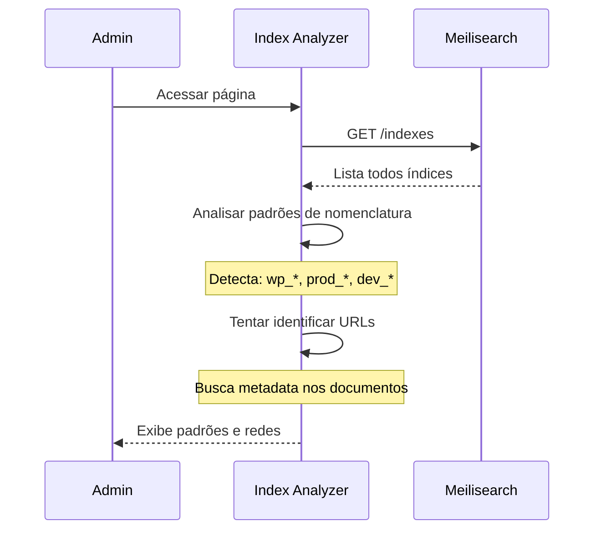

# 👨‍💼 Guia do Administrador

Guia completo para administradores de rede gerenciarem o plugin Meilisearch Network Search.

## Responsabilidades do Administrador

Como administrador de rede, você é responsável por:

- ✅ Configurar e manter a conexão com Meilisearch
- ✅ Gerenciar indexação de conteúdo em toda a rede
- ✅ Monitorar performance e estatísticas
- ✅ Resolver problemas de busca
- ✅ Otimizar resultados de busca

## Dashboard Principal

Acesse: **Network Admin → Meilisearch → Dashboard**



### System Status

Visão rápida do estado do sistema:

| Indicador | Significado | Cor |
|-----------|-------------|-----|
| 🟢 **Connected** | Conexão OK com Meilisearch | Verde |
| 🟡 **Indexing** | Indexação em andamento | Amarelo |
| 🔴 **Disconnected** | Sem conexão com Meilisearch | Vermelho |

### Quick Actions

Botões de ação rápida:

- **Reindex All Sites** - Reindexar toda a rede
- **Clear Cache** - Limpar cache de transients
- **Test Connection** - Testar conexão com Meilisearch
- **View Logs** - Ver logs de debug

## Indexando Conteúdo

### Indexação Inicial

Após instalar e configurar o plugin, você precisa indexar o conteúdo existente.

#### Via WP-CLI (Recomendado)

```bash
# Indexar toda a rede
wp meilisearch index --network

# Ver progresso detalhado
wp meilisearch index --network --debug

# Indexar site específico
wp meilisearch index --url=site1.example.com
```

**Vantagens**:
- Mais rápido (usa Fibers para concorrência)
- Não sofre timeout HTTP
- Pode rodar em background
- Mostra progresso detalhado

#### Via Dashboard

1. Acesse **Meilisearch → Dashboard**
2. Clique **"Reindex All Sites"**
3. Aguarde conclusão (pode demorar para redes grandes)

**Limitações**:
- Sujeito a timeout HTTP (max 300s)
- Não mostra progresso em tempo real
- Melhor para redes pequenas (menos de 10 sites)

### Reindexação

Quando reindexar:

- ✅ Após mudar post types indexados
- ✅ Após alterar configurações do índice
- ✅ Se resultados parecem desatualizados
- ✅ Após restaurar backup do banco
- ✅ Se houver erros de sincronização

```bash
# Reindexar tudo
wp meilisearch reindex --network

# Reindexar apenas um site
wp meilisearch reindex --blog_id=2
```

### Indexação Automática

O plugin indexa automaticamente quando:

| Evento | Ação |
|--------|------|
| Post publicado | Adiciona ao índice |
| Post atualizado | Atualiza no índice |
| Post despublicado | Remove do índice |
| Post deletado | Remove do índice |
| Novo site criado | Cria novo índice |
| Site deletado | Remove índice |

**Verificar logs**:

```bash
# Ver últimas linhas do debug.log
tail -f wp-content/debug.log | grep Meilisearch
```

## Gerenciando Índices

### Listar Índices

```bash
# Via WP-CLI
wp meilisearch list_indexes

# Exemplo de saída:
# Index Name       | Documents | Size
# -----------------|-----------|-------
# wp_1_posts       | 150       | 2.3MB
# wp_2_posts       | 89        | 1.1MB
# wp_3_posts       | 234       | 3.5MB
```

Via Dashboard: **Meilisearch → Metrics**

### Criar Índice Manualmente

```bash
# Criar índice para site específico
wp meilisearch create_index <blog_id>

# Exemplo:
wp meilisearch create_index 2
```

### Deletar Índice

```bash
# Deletar índice de site específico
wp meilisearch delete_index <blog_id> --yes

# Exemplo:
wp meilisearch delete_index 2 --yes
```

⚠️ **Cuidado**: Deletar índice remove todos os dados indexados. Será necessário reindexar.

### Visualizar Estatísticas

```bash
# Ver estatísticas gerais
wp meilisearch stats

# Exemplo de saída:
# Network Stats:
# - Total Sites: 3
# - Total Indexes: 3
# - Total Documents: 473
# - Total Size: 6.9MB
# - Status: Connected
```

Via Dashboard: **Meilisearch → Metrics**

## Monitorando Performance

### Página de Métricas

Acesse: **Network Admin → Meilisearch → Metrics**



### Métricas por Site

| Métrica | Descrição | Ação se Problemático |
|---------|-----------|---------------------|
| **Documents** | Quantidade de posts indexados | Comparar com total de posts no site |
| **Size** | Tamanho do índice | Se muito grande, revisar o que está sendo indexado |
| **Is Indexing** | Se indexação está em andamento | Se sempre "true", investigar tarefas travadas |
| **Last Update** | Última modificação do índice | Se muito antigo, reindexar |

### Alertas Automáticos

Configure alertas para:

- 🚨 Índice não sincronizado há mais de 1 hora
- 🚨 Tamanho do índice excede limite
- 🚨 Conexão com Meilisearch perdida
- 🚨 Taxa de erro de busca acima de 5%

## Otimização de Resultados

### Ajustar Relevância

Edite as **Searchable Attributes** para priorizar campos:

```php
// No tema ou plugin personalizado
add_filter('meilisearch_index_settings', function($settings, $blog_id) {
    // Dar mais peso ao título
    $settings['searchableAttributes'] = [
        'title',      // Peso máximo
        'excerpt',
        'content',
        'categories'
    ];
    return $settings;
}, 10, 2);
```

### Typo Tolerance

Configurar tolerância a erros de digitação:

```php
add_filter('meilisearch_index_settings', function($settings) {
    $settings['typoTolerance'] = [
        'enabled' => true,
        'minWordSizeForTypos' => [
            'oneTypo' => 5,    // Aceita 1 erro em palavras com 5+ letras
            'twoTypos' => 9    // Aceita 2 erros em palavras com 9+ letras
        ]
    ];
    return $settings;
});
```

### Sinônimos

Adicionar sinônimos para melhorar resultados:

```bash
# Via WP-CLI (futuro)
wp meilisearch add_synonyms "wordpress,wp,wordPress"
wp meilisearch add_synonyms "javascript,js"
```

### Stop Words

Ignorar palavras comuns (artigos, preposições):

```php
add_filter('meilisearch_index_settings', function($settings) {
    $settings['stopWords'] = ['o', 'a', 'de', 'da', 'do', 'e', 'é'];
    return $settings;
});
```

## Multi-Pattern Search

Para redes que compartilham o mesmo Meilisearch com outras instalações WordPress.

### Detectar Padrões

Acesse: **Network Admin → Meilisearch → Index Analyzer**



**Resultado esperado**:

```
Padrões Detectados:
━━━━━━━━━━━━━━━━━━━━━━━━━━━━━━━━━━
Pattern    | Count | Network URL
-----------|-------|------------------
wp_*       | 3     | https://site1.com
prod_*     | 2     | https://site2.com
dev_*      | 2     | https://dev.site.com
```

### Configurar Multi-Pattern

Acesse: **Network Admin → Meilisearch → Multi-Pattern Search**

1. Selecione os padrões para incluir nas buscas
2. Salve configurações
3. Teste a busca multi-pattern

**Exemplo de uso**:

```
Cenário: Empresa com 2 redes WordPress

Rede 1 (Pública):
- wp_1_posts (blog)
- wp_2_posts (noticias)

Rede 2 (Interna):
- intranet_1_posts (docs)
- intranet_2_posts (wiki)

Configuração:
☑️ wp_* - Incluir rede pública
☑️ intranet_* - Incluir intranet

Resultado: Busca pesquisa em ambas as redes
```

## Solução de Problemas

### Resultados Não Aparecem

**Checklist**:

1. ✅ Plugin habilitado? (`Settings → enabled = true`)
2. ✅ Conteúdo indexado? (`wp meilisearch stats`)
3. ✅ Conexão OK? (`wp meilisearch health`)
4. ✅ Post type correto? (`Settings → post_types`)
5. ✅ Post publicado? (status = `publish`)

**Debug**:

```bash
# Buscar diretamente no Meilisearch
wp meilisearch search "termo" --blog_id=1 --debug
```

### Busca Muito Lenta

**Possíveis causas**:

| Causa | Sintoma | Solução |
|-------|---------|---------|
| Muitos índices | >10 índices | Usar multi-pattern para filtrar |
| Documentos grandes | Size >100MB por índice | Reduzir campos indexados |
| Hardware limitado | CPU/RAM insuficiente | Aumentar recursos do Meilisearch |
| Rede lenta | High latency | Colocar Meilisearch próximo ao WordPress |

**Otimizações**:

```bash
# Ver tempo de resposta
wp meilisearch search "termo" --time

# Ver query SQL gerada
wp meilisearch search "termo" --explain
```

### Autocomplete Não Funciona

**Verificações**:

1. JavaScript carregado?
   ```bash
   # Ver source da página
   curl -s https://seusite.com | grep "autocomplete.js"
   ```

2. REST API acessível?
   ```bash
   curl "https://seusite.com/wp-json/meilisearch/v1/autocomplete?q=test"
   ```

3. Erros no console?
   - Abrir DevTools (F12)
   - Verificar aba Console
   - Digitar no campo de busca

**Solução comum**:

```php
// Forçar enqueue do script
add_action('wp_enqueue_scripts', function() {
    wp_enqueue_script('meilisearch-autocomplete');
}, 999);
```

### Sincronização Falhando

**Logs**:

```bash
# Verificar erros no debug.log
grep -i "meilisearch.*error" wp-content/debug.log

# Ver últimos 50 erros
tail -n 50 wp-content/debug.log | grep Meilisearch
```

**Causas comuns**:

1. **Timeout**: Aumentar `max_execution_time` no PHP
2. **Memory limit**: Aumentar `memory_limit` no PHP
3. **Conexão perdida**: Verificar rede/firewall
4. **Master key expirada**: Regerar key no Meilisearch

## Manutenção Preventiva

### Checklist Semanal

- [ ] Verificar status da conexão
- [ ] Revisar métricas de todos os sites
- [ ] Verificar logs de erro
- [ ] Testar busca em sites aleatórios
- [ ] Comparar quantidade de documentos vs posts

### Checklist Mensal

- [ ] Reindexar rede completa
- [ ] Limpar cache de transients
- [ ] Verificar espaço em disco do Meilisearch
- [ ] Revisar configurações de relevância
- [ ] Atualizar plugin e dependências

### Checklist Trimestral

- [ ] Backup de configurações e índices
- [ ] Revisar e otimizar stop words
- [ ] Adicionar/atualizar sinônimos
- [ ] Performance testing (load test)
- [ ] Revisar documentação de usuários

## Segurança

### Controle de Acesso

- ✅ Master key **nunca** exposta no frontend
- ✅ Configurações acessíveis apenas para super admins
- ✅ REST API usa nonces do WordPress
- ✅ Sanitização de queries de busca

### Logs Sensíveis

Evitar logar informações sensíveis:

```php
// EVITAR:
error_log("Master key: " . $master_key);

// CORRETO:
error_log("Meilisearch connection failed");
```

### Atualizações

- 🔄 Manter plugin atualizado
- 🔄 Manter Meilisearch atualizado
- 🔄 Manter dependências PHP atualizadas (`composer update`)

## Recursos Avançados

### Custom Ranking

Priorizar documentos mais recentes:

```php
add_filter('meilisearch_search_params', function($params) {
    $params['sort'] = ['date:desc'];
    return $params;
});
```

### Faceted Search

Adicionar filtros laterais:

```php
add_filter('meilisearch_search_params', function($params) {
    $params['facets'] = ['categories', 'post_type'];
    return $params;
});
```

### Highlight

Destacar termos encontrados:

```php
add_filter('meilisearch_search_params', function($params) {
    $params['attributesToHighlight'] = ['title', 'excerpt'];
    return $params;
});
```

## Próximos Passos

- [Referência da API](../topicos-avancados/api-reference.md) - Detalhes técnicos
- [Troubleshooting](../topicos-avancados/troubleshooting.md) - Mais soluções
- [Guia do Desenvolvedor](developer-guide.md) - Customizações
