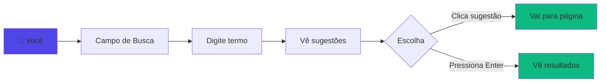
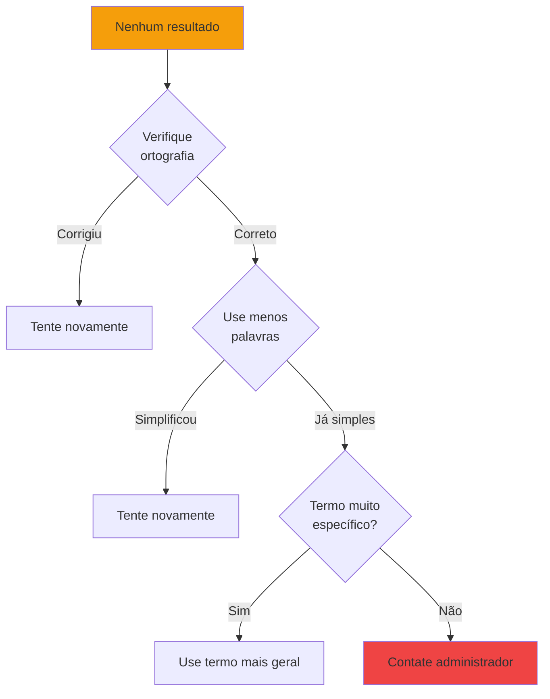

# 👤 Guia do Usuário

Guia para usuários finais utilizarem a busca melhorada do Meilisearch.

## O que é Meilisearch?

Meilisearch é um motor de busca ultrarrápido que substitui a busca padrão do WordPress, oferecendo:

- ⚡ **Resultados instantâneos** - Busca 10x mais rápida
- 🔍 **Autocomplete inteligente** - Sugestões enquanto você digita
- 🎯 **Maior relevância** - Encontra exatamente o que você procura
- 🌐 **Busca em toda a rede** - Pesquise em todos os sites da rede

## Como Usar a Busca

### Busca Básica



1. **Localize o campo de busca** (geralmente no cabeçalho)
2. **Digite o termo** que você procura
3. **Veja as sugestões** aparecerem automaticamente
4. **Clique em uma sugestão** ou pressione Enter

### Autocomplete

Enquanto você digita, o Meilisearch sugere resultados relevantes em tempo real:

```
Digite: "wordpr"
Sugestões:
┌─────────────────────────────────────┐
│ 🔍 WordPress para Iniciantes        │
│ 🔍 WordPress Themes                 │
│ 🔍 WordPress Plugins Essenciais     │
└─────────────────────────────────────┘
```

**Dicas**:
- Não precisa digitar a palavra completa
- Funciona mesmo com erros de digitação
- Mostra até 5 sugestões mais relevantes

### Operadores de Busca

#### Busca Simples

```
termo
```

Exemplo: `wordpress` - Encontra posts contendo "wordpress"

#### Múltiplas Palavras

```
termo1 termo2
```

Exemplo: `wordpress plugin` - Encontra posts com ambos os termos

#### Frase Exata

```
"frase exata"
```

Exemplo: `"guia completo"` - Encontra a frase exata

#### Excluir Termo

```
termo -excluir
```

Exemplo: `wordpress -theme` - Encontra "wordpress" mas não "theme"

## Tipos de Conteúdo

A busca encontra diferentes tipos de conteúdo:

| Tipo | Ícone | Descrição |
|------|-------|-----------|
| **Post** | 📝 | Posts do blog |
| **Página** | 📄 | Páginas estáticas |
| **Produto** | 🛒 | Produtos (WooCommerce) |
| **Evento** | 📅 | Eventos agendados |

## Resultados de Busca

### O que você vê

```
┌─────────────────────────────────────────────────┐
│ 🔍 Pesquisa por: "wordpress"                    │
│                                                 │
│ 📝 Encontrados 23 resultados                    │
│                                                 │
│ ┌──────────────────────────────────────────┐    │
│ │ Guia Completo de WordPress 2024          │    │
│ │ Aprenda WordPress do zero com este guia  │    │
│ │ completo...                              │    │
│ │ 📅 15 Set 2024 | 👤 João                 │    │
│ └──────────────────────────────────────────┘    │
│                                                 │
│ ┌──────────────────────────────────────────┐    │
│ │ Melhores Plugins WordPress               │    │
│ │ Conheça os 10 plugins essenciais para... │    │
│ │ 📅 10 Set 2024 | 👤 Maria                │    │
│ └──────────────────────────────────────────┘    │
│                                                 │
│ [1] 2 3 ... 5                                   │
└─────────────────────────────────────────────────┘
```

### Ordem dos Resultados

Os resultados são ordenados por **relevância**:

1. **Título contém termo** - Maior peso
2. **Resumo contém termo** - Peso médio
3. **Conteúdo contém termo** - Peso menor
4. **Categorias/Tags** - Peso mínimo

### Nenhum Resultado?



**Dicas**:
- ✅ Verifique erros de digitação
- ✅ Use termos mais genéricos
- ✅ Tente sinônimos
- ✅ Remova acentos
- ✅ Use menos palavras

## Busca Avançada

### Filtrar por Site

Em redes multisite, você pode buscar em sites específicos:

```
termo site:blog.example.com
```

### Filtrar por Data

```
termo ano:2025
termo mes:setembro
```

### Filtrar por Autor

```
termo autor:joao
```

### Combinar Filtros

```
wordpress plugin ano:2025 -theme
```

Encontra posts sobre "wordpress plugin" de 2024, excluindo "theme"

## Atalhos de Teclado

| Atalho | Ação |
|--------|------|
| `/` | Focar no campo de busca |
| `Esc` | Fechar sugestões |
| `↓` / `↑` | Navegar sugestões |
| `Enter` | Ir para resultado selecionado |

## FAQ

### Por que os resultados são diferentes do Google?

O Meilisearch busca apenas no conteúdo deste site WordPress, enquanto o Google indexa toda a internet. Os resultados são mais relevantes para o conteúdo interno do site.

### Posso buscar por imagens?

Atualmente, a busca funciona apenas para texto (títulos, conteúdo, etc.). As imagens são encontradas apenas se tiverem descrição textual.

### A busca funciona em todas as páginas?

Sim! O campo de busca funciona em qualquer página do site.

### Minha busca é privada?

Sim. As buscas não são rastreadas externamente. Apenas os administradores do site podem ver estatísticas agregadas (não buscas individuais).

### Como reportar um problema?

Se a busca não funcionar:
1. Atualize a página (F5)
2. Limpe o cache do navegador
3. Tente outro navegador
4. Contate o administrador do site

## Dicas de Produtividade

### Busque por Conteúdo, Não URL

❌ **Evite**: Buscar URLs completas
✅ **Prefira**: Buscar palavras-chave do conteúdo

### Use Termos Específicos

❌ **Evite**: Termos muito genéricos ("artigo", "post")
✅ **Prefira**: Termos específicos ("tutorial wordpress", "receita bolo")

### Aproveite o Autocomplete

❌ **Evite**: Digitar tudo e depois buscar
✅ **Prefira**: Ver sugestões e clicar diretamente

### Copie Links dos Resultados

Use **Ctrl+C** (ou **Cmd+C** no Mac) no link do resultado para compartilhar diretamente.

## Suporte

Problemas com a busca? Entre em contato:

- 📧 Email: joao.jesus@sorocaba.sp.gov.br
- 💬 Chat: Suporte online no site
- 📞 Telefone: +55 15 1234-5678

---

**Aproveite a busca ultrarrápida!** 🚀
