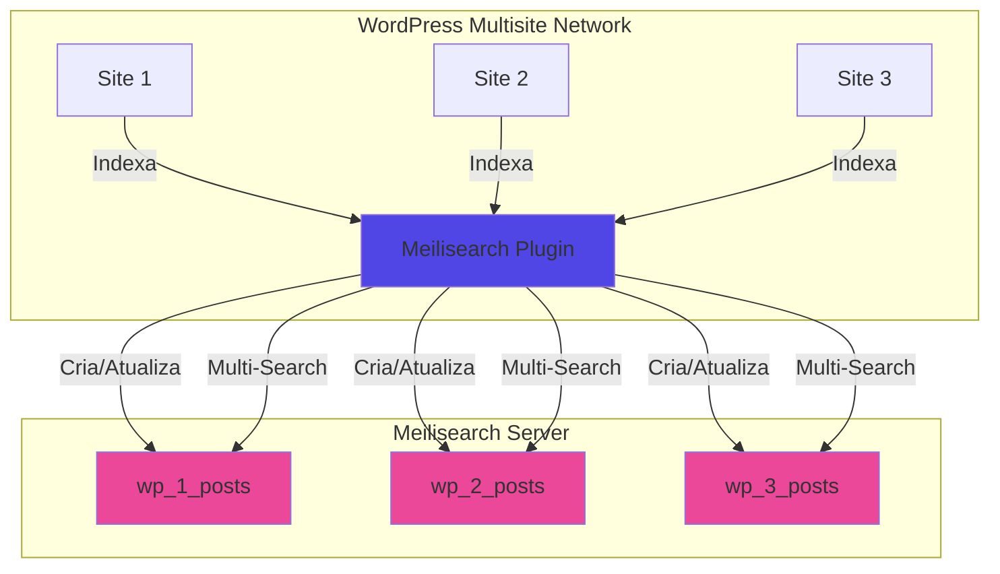

# Documentação do Plugin Meilisearch Network Search

Bem-vindo à documentação completa do plugin **Meilisearch Network Search** para WordPress Multisite.

## 📚 Índice da Documentação

### Primeiros Passos
- [🚀 Instalação](installation.md) - Guia passo a passo para instalar e configurar o plugin
- [⚙️ Configuração](configuration.md) - Opções de configuração e ajustes

### Guias de Uso
- [👤 Guia do Usuário](usage/user-guide.md) - Para usuários finais
- [👨‍💼 Guia do Administrador](usage/admin-guide.md) - Para administradores de rede
- [👨‍💻 Guia do Desenvolvedor](usage/developer-guide.md) - Para desenvolvedores e contribuidores

### Arquitetura e Recursos
- [🏗️ Arquitetura do Sistema](architecture.md) - Visão técnica da arquitetura (com diagramas)
- [🔍 Sistema de Busca](features/search.md) - Como funciona a busca
- [📊 Sistema de Indexação](features/indexing.md) - Indexação e sincronização
- [⚡ Autocomplete](features/autocomplete.md) - Sugestões em tempo real
- [📈 Métricas](features/metrics.md) - Estatísticas e monitoramento
- [🔗 Multi-Pattern Search](features/multi-pattern.md) - Busca multi-rede
- [🔎 Index Analyzer](features/index-analyzer.md) - Análise de padrões de índice

### Referência Técnica
- [📖 Referência da API](api-reference.md) - Documentação das APIs REST e WP-CLI
- [🔧 Troubleshooting](troubleshooting.md) - Solução de problemas comuns

## 🌟 Visão Geral

O **Meilisearch Network Search** é um plugin WordPress Multisite que substitui o sistema de busca padrão do WordPress pelo [Meilisearch](https://www.meilisearch.com/), um motor de busca ultrarrápido e open-source.

### Principais Características

- **🌐 Busca em toda a rede** - Pesquise em todos os sites da sua rede multisite
- **⚡ Velocidade extrema** - Resultados instantâneos com Meilisearch
- **🔍 Autocomplete automático** - Sugestões em tempo real enquanto digita
- **🎯 Configuração fácil** - Interface administrativa intuitiva
- **🔄 Sincronização automática** - Conteúdo indexado automaticamente
- **🚀 PHP Moderno** - Usa Fiber + ReactPHP para operações concorrentes (PHP 8.1+)
- **📊 Métricas em tempo real** - Monitore estatísticas sem cache
- **🔗 Multi-Pattern Search** - Busque em múltiplas redes WordPress simultaneamente

### Requisitos

| Requisito | Versão Mínima |
|-----------|---------------|
| WordPress | 6.0+ |
| WordPress Multisite | Obrigatório |
| PHP | 8.1+ |
| Meilisearch | v1.0+ |

### Arquitetura Rápida

### Começando

1. **[Instale o plugin](installation.md)** seguindo o guia de instalação
2. **[Configure as credenciais](configuration.md)** do Meilisearch no painel de rede
3. **[Indexe o conteúdo](usage/admin-guide.md#indexando-conteúdo)** usando WP-CLI ou interface administrativa
4. **[Comece a buscar](usage/user-guide.md)** - a busca será automaticamente substituída!

### Suporte e Contribuições

- **Repositório**: [github.com/joaovjo/meilisearch](https://github.com/joaovjo/meilisearch)
- **Issues**: [github.com/joaovjo/meilisearch/issues](https://github.com/joaovjo/meilisearch/issues)
- **Documentação Meilisearch**: [docs.meilisearch.com](https://www.meilisearch.com/docs)

### Licença

Este plugin é licenciado sob **GPL-2.0-or-later**. Veja o arquivo LICENSE para mais detalhes.
