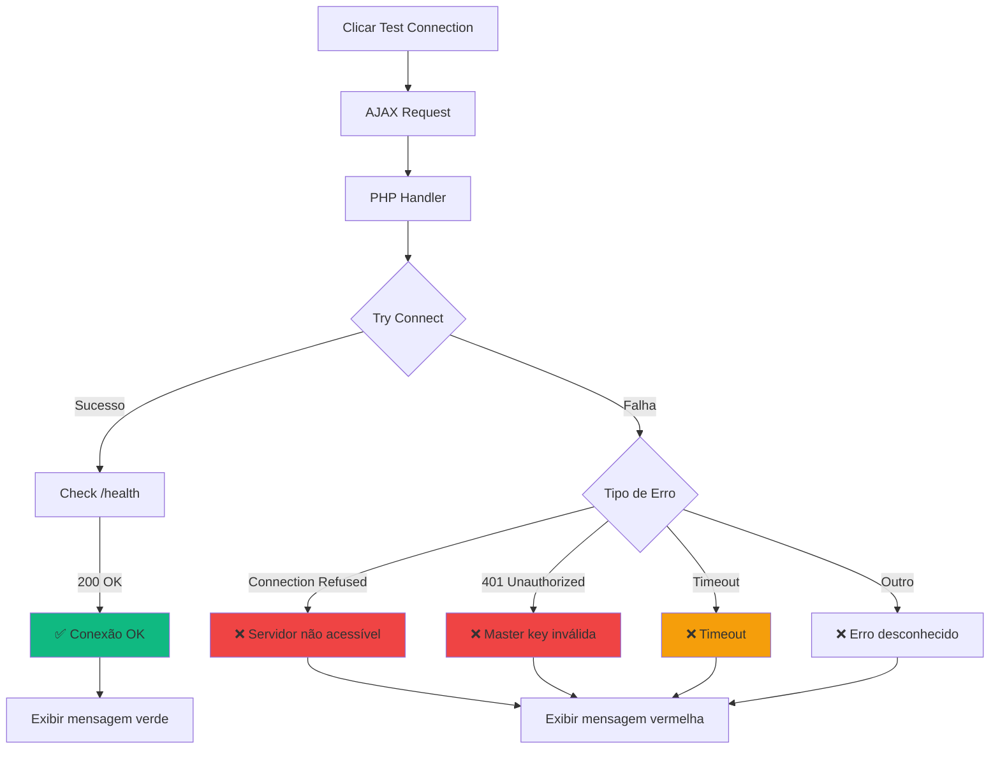
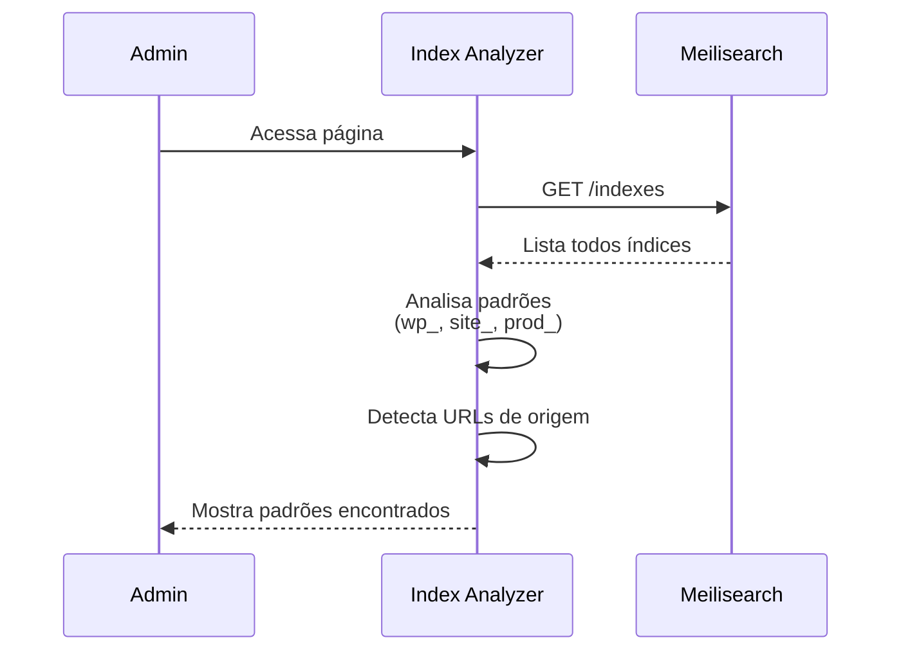

# ⚙️ Configuração

Guia completo de todas as opções de configuração do plugin Meilisearch Network Search.

## Localização das Configurações

Todas as configurações são gerenciadas em **Network Admin**:

```
Network Admin → Settings → Meilisearch
```

**Importante**: Como este é um plugin de rede, as configurações são globais e aplicam-se a todos os sites da rede.

## Configurações Principais

### Conexão Meilisearch

#### Meilisearch Host

**Campo**: `meilisearch_settings[host]`
**Tipo**: URL
**Obrigatório**: Sim
**Padrão**: `http://localhost:7700`

URL completa do servidor Meilisearch, incluindo protocolo e porta.

**Exemplos válidos**:
```
http://localhost:7700
https://meilisearch.example.com
http://192.168.1.100:7700
https://ms-abc123.meilisearch.io
```

**Notas**:
- Sempre inclua o protocolo (`http://` ou `https://`)
- Para Docker, use o nome do serviço: `http://meilisearch:7700`
- Para produção, prefira HTTPS

#### Master Key

**Campo**: `meilisearch_settings[master_key]`
**Tipo**: String
**Obrigatório**: Recomendado (obrigatório em produção)
**Padrão**: `''` (vazio)

Chave mestra configurada no servidor Meilisearch via variável de ambiente `MEILI_MASTER_KEY`.

**Segurança**:
- Em desenvolvimento local, pode ser vazio
- Em produção, **sempre** configure uma master key forte
- Mínimo 16 caracteres alfanuméricos
- Use geradores de senha seguros

**Como definir no Meilisearch**:
```bash
# Docker
docker run -e MEILI_MASTER_KEY=SuaChaveSegura123 getmeili/meilisearch

# Binário
./meilisearch --master-key="SuaChaveSegura123"
```

### Ativação do Plugin

#### Habilitar Meilisearch

**Campo**: `meilisearch_settings[enabled]`
**Tipo**: Checkbox (boolean)
**Padrão**: `false`

Controla se o plugin deve substituir a busca padrão do WordPress.

**Comportamentos**:
- `true`: Busca do WordPress é substituída por Meilisearch
- `false`: WordPress usa busca padrão (Meilisearch não é usado)

**Casos de uso para desabilitar**:
- Durante manutenção do Meilisearch
- Durante reindexação massiva
- Para comparar resultados entre WordPress e Meilisearch

### Post Types para Indexação

#### Post Types

**Campo**: `meilisearch_settings[post_types]`
**Tipo**: Array de strings
**Padrão**: `['post', 'page']`

Lista de post types que devem ser indexados no Meilisearch.

**Post Types Comuns**:
- `post` - Posts do blog
- `page` - Páginas
- `attachment` - Mídia/arquivos
- Custom Post Types - Qualquer CPT registrado

**Exemplo de configuração**:
```php
$settings = [
    'post_types' => ['post', 'page', 'product', 'evento']
];
```

**Interface**:
Checkboxes para cada post type disponível na rede.

### Formato do Índice

#### Index Prefix

**Campo**: `meilisearch_settings[index_prefix]`
**Tipo**: String
**Padrão**: `wp`

Prefixo usado na nomenclatura dos índices.

**Formato final**: `{prefix}_{blog_id}_posts`

**Exemplos**:
- Prefixo `wp` → `wp_1_posts`, `wp_2_posts`
- Prefixo `site` → `site_1_posts`, `site_2_posts`
- Prefixo `prod` → `prod_1_posts`, `prod_2_posts`

**Casos de uso**:
- Múltiplas instalações WordPress no mesmo Meilisearch
- Ambientes diferentes (dev, staging, prod)
- Separação lógica de conteúdo

## Configurações Avançadas

### Settings do Índice Meilisearch

Configurações aplicadas automaticamente a cada índice criado:

#### Searchable Attributes

Campos pesquisáveis por ordem de prioridade:

```php
[
    'title',        // Maior peso
    'excerpt',
    'content',
    'categories',
    'tags',
    'author'        // Menor peso
]
```

#### Filterable Attributes

Campos que podem ser filtrados:

```php
[
    'blog_id',
    'post_type',
    'post_status',
    'author_id',
    'categories',
    'tags',
    'date',
    'modified'
]
```

#### Sortable Attributes

Campos ordenáveis:

```php
[
    'date',
    'modified',
    'title'
]
```

#### Ranking Rules

Regras de relevância (ordem de aplicação):

```php
[
    'words',        // Correspondência de palavras
    'typo',         // Tolerância a erros de digitação
    'proximity',    // Proximidade dos termos
    'attribute',    // Posição nos atributos searchable
    'sort',         // Ordenação customizada
    'exactness'     // Correspondência exata
]
```

## Teste de Conexão

### Como Testar

1. Preencha `Host` e `Master Key`
2. Clique no botão **"Test Connection"**
3. Aguarde resposta

### Possíveis Resultados



### Mensagens de Erro

| Erro | Significado | Solução |
|------|-------------|---------|
| **Connection refused** | Meilisearch não está rodando | Iniciar servidor Meilisearch |
| **401 Unauthorized** | Master key incorreta | Verificar `MEILI_MASTER_KEY` |
| **Timeout** | Servidor muito lento/inativo | Verificar recursos do servidor |
| **Could not resolve host** | URL do host inválida | Verificar URL (incluir `http://`) |

## Multi-Pattern Search Configuration

Para configurar busca em múltiplas redes WordPress:

### 1. Detectar Padrões

Acesse **Network Admin → Meilisearch → Index Analyzer**:



Resultado esperado:
```
Padrões detectados:
- wp_* (3 índices) → https://site1.com
- prod_* (2 índices) → https://site2.com
- dev_* (2 índices) → https://dev.site.com
```

### 2. Configurar Padrões Ativos

Acesse **Network Admin → Meilisearch → Multi-Pattern Search**:

1. Selecione padrões para incluir na busca
2. Clique **"Save Settings"**
3. Teste com **"Test Search"**

**Exemplo de configuração**:
```
☑️ wp_* (site1.com) - Rede principal
☑️ prod_* (site2.com) - Rede secundária
☐ dev_* (dev.site.com) - Não incluir dev
```

## Configuração via Código

### Filtrar Configurações Padrão

```php
add_filter('meilisearch_default_settings', function($defaults) {
    $defaults['host'] = 'http://meilisearch:7700';
    $defaults['post_types'] = ['post', 'page', 'product'];
    $defaults['index_prefix'] = 'prod';
    return $defaults;
});
```

### Modificar Settings do Índice

```php
add_filter('meilisearch_index_settings', function($settings, $blog_id) {
    // Adicionar campo customizado como searchable
    $settings['searchableAttributes'][] = 'custom_field';
    
    // Adicionar campo customizado como filterable
    $settings['filterableAttributes'][] = 'custom_taxonomy';
    
    return $settings;
}, 10, 2);
```

### Customizar Nome do Índice

```php
add_filter('meilisearch_index_name', function($index_name, $blog_id) {
    // Usar domínio em vez de blog_id
    $domain = get_blog_details($blog_id)->domain;
    $domain_slug = str_replace('.', '_', $domain);
    return "wp_{$domain_slug}_posts";
}, 10, 2);
```

## Variáveis de Ambiente

Para ambientes containerizados, use variáveis de ambiente:

```env
# .env
MEILISEARCH_HOST=http://meilisearch:7700
MEILISEARCH_MASTER_KEY=SuaChaveSegura123
MEILISEARCH_ENABLED=true
MEILISEARCH_INDEX_PREFIX=prod
```

No `wp-config.php`:

```php
// Sobrescrever configurações com env vars
if (getenv('MEILISEARCH_HOST')) {
    define('MEILISEARCH_HOST', getenv('MEILISEARCH_HOST'));
}
if (getenv('MEILISEARCH_MASTER_KEY')) {
    define('MEILISEARCH_MASTER_KEY', getenv('MEILISEARCH_MASTER_KEY'));
}
```

No plugin, verificar constantes:

```php
$settings = get_site_option('meilisearch_settings');

if (defined('MEILISEARCH_HOST')) {
    $settings['host'] = MEILISEARCH_HOST;
}
if (defined('MEILISEARCH_MASTER_KEY')) {
    $settings['master_key'] = MEILISEARCH_MASTER_KEY;
}
```

## Configuração por Ambiente

### Desenvolvimento

```php
$settings = [
    'host' => 'http://localhost:7700',
    'master_key' => '', // Sem master key em dev
    'enabled' => true,
    'post_types' => ['post', 'page'],
    'index_prefix' => 'dev'
];
```

### Staging

```php
$settings = [
    'host' => 'http://staging-meili:7700',
    'master_key' => 'staging_key_123',
    'enabled' => true,
    'post_types' => ['post', 'page', 'product'],
    'index_prefix' => 'staging'
];
```

### Produção

```php
$settings = [
    'host' => 'https://meilisearch.example.com',
    'master_key' => 'producao_key_muito_segura_123',
    'enabled' => true,
    'post_types' => ['post', 'page', 'product', 'event'],
    'index_prefix' => 'prod'
];
```

## Verificação de Saúde

### Checklist de Configuração

Antes de ativar o plugin em produção:

- [ ] Meilisearch acessível (teste de conexão OK)
- [ ] Master key configurada e segura
- [ ] Post types corretos selecionados
- [ ] Index prefix apropriado para ambiente
- [ ] Conteúdo inicial indexado
- [ ] Teste de busca retorna resultados
- [ ] Autocomplete funcionando
- [ ] Sem erros no debug.log

### Monitoramento Contínuo

Acesse **Network Admin → Meilisearch → Metrics** para monitorar:

- **Index Size**: Tamanho de cada índice
- **Documents Count**: Quantidade de documentos
- **Is Indexing**: Status de indexação
- **Last Update**: Última atualização

## Backup e Restauração

### Backup de Configurações

```php
// Exportar configurações
$settings = get_site_option('meilisearch_settings');
file_put_contents('meilisearch-settings-backup.json', json_encode($settings, JSON_PRETTY_PRINT));
```

### Restaurar Configurações

```php
// Importar configurações
$settings = json_decode(file_get_contents('meilisearch-settings-backup.json'), true);
update_site_option('meilisearch_settings', $settings);
```

### Backup de Índices

```bash
# Via WP-CLI
wp meilisearch export --network --output=./backup/

# Restaurar
wp meilisearch import --network --input=./backup/
```

## Próximos Passos

- [Guia do Administrador](usage/admin-guide.md) - Como gerenciar o plugin
- [Métricas](features/metrics.md) - Monitorar performance
- [Troubleshooting](troubleshooting.md) - Resolver problemas comuns
