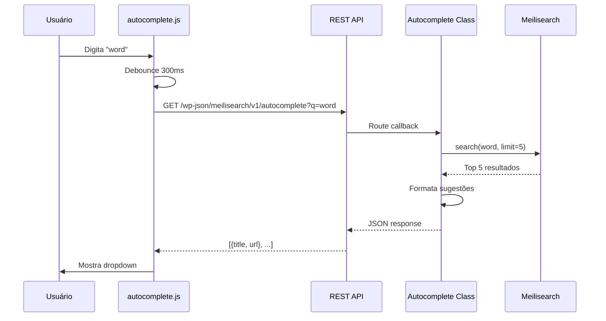

# ⚡ Autocomplete

Sistema de sugestões automáticas em tempo real enquanto o usuário digita.

## Visão Geral

O autocomplete fornece sugestões instantâneas de posts relevantes enquanto o usuário digita no campo de busca, melhorando significativamente a experiência do usuário.

## Como Funciona



## Características

- ⚡ **Respostas em <50ms** - Extremamente rápido
- 🎯 **Até 5 sugestões** por padrão
- 🔄 **Debounce de 300ms** - Evita requisições excessivas
- 💾 **Cache no navegador** - Reduz requisições repetidas
- 📱 **Responsivo** - Funciona em mobile
- ⌨️ **Navegação por teclado** - Setas ↑↓ e Enter

## Ativação Automática

O autocomplete é ativado automaticamente em qualquer campo de busca que tenha o atributo:

```html
<input type="search" name="s" data-meilisearch-autocomplete>
```

Ou classes específicas:

```html
<input type="search" name="s" class="search-field">
```

## REST API Endpoint

### GET /wp-json/meilisearch/v1/autocomplete

**Parâmetros**:

| Parâmetro | Tipo | Obrigatório | Descrição |
|-----------|------|-------------|-----------|
| `q` | string | Sim | Termo de busca |
| `limit` | int | Não | Máximo de sugestões (padrão: 5) |
| `blog_id` | int | Não | ID do site específico |

**Exemplo de Requisição**:

```bash
curl "https://seusite.com/wp-json/meilisearch/v1/autocomplete?q=wordpress&limit=3"
```

**Exemplo de Resposta**:

```json
{
  "success": true,
  "results": [
    {
      "id": "1_42",
      "title": "Guia Completo de WordPress",
      "excerpt": "Aprenda WordPress do zero...",
      "url": "https://site.com/guia-wordpress",
      "blog_id": 1,
      "post_id": 42
    },
    {
      "id": "1_43",
      "title": "WordPress para Iniciantes",
      "url": "https://site.com/wp-iniciantes",
      "blog_id": 1,
      "post_id": 43
    }
  ],
  "total": 150,
  "query": "wordpress",
  "time": 0.023
}
```

## Personalização

### Modificar Limite de Sugestões

```javascript
// No seu tema
document.addEventListener('DOMContentLoaded', function() {
    const searchInput = document.querySelector('[data-meilisearch-autocomplete]');
    if (searchInput) {
        searchInput.dataset.autocompleteLimit = '10';
    }
});
```

### Estilizar Dropdown

```css
/* No seu tema CSS */
.meilisearch-autocomplete-dropdown {
    background: white;
    border: 1px solid #ddd;
    box-shadow: 0 4px 6px rgba(0,0,0,0.1);
    max-height: 400px;
    overflow-y: auto;
}

.meilisearch-autocomplete-item {
    padding: 12px 16px;
    cursor: pointer;
}

.meilisearch-autocomplete-item:hover,
.meilisearch-autocomplete-item.active {
    background: #f0f0f0;
}

.meilisearch-autocomplete-item strong {
    color: #2271b1;
}
```

### Customizar Template

```javascript
// Filtrar resultados antes de exibir
document.addEventListener('meilisearch:autocomplete:before-render', function(e) {
    console.log('Resultados:', e.detail.results);
    
    // Modificar resultados
    e.detail.results = e.detail.results.filter(result => {
        return result.post_type === 'post';
    });
});

// Após renderizar
document.addEventListener('meilisearch:autocomplete:after-render', function(e) {
    console.log('Dropdown renderizado');
});
```

## Eventos JavaScript

O autocomplete dispara eventos customizados:

| Evento | Quando | Dados |
|--------|--------|-------|
| `meilisearch:autocomplete:query` | Usuário digita | `{query}` |
| `meilisearch:autocomplete:results` | Recebe resultados | `{results, total}` |
| `meilisearch:autocomplete:select` | Clica em sugestão | `{result}` |
| `meilisearch:autocomplete:error` | Erro na requisição | `{error}` |

**Exemplo de uso**:

```javascript
document.addEventListener('meilisearch:autocomplete:select', function(e) {
    console.log('Usuário selecionou:', e.detail.result.title);
    
    // Enviar analytics
    gtag('event', 'autocomplete_select', {
        query: e.detail.result.title
    });
});
```

## Performance

### Cache

O autocomplete usa cache em dois níveis:

1. **Cache do navegador** (SessionStorage)
   - Armazena resultados da sessão
   - Expira ao fechar navegador

2. **Cache do servidor** (Transients)
   - Armazena por 5 minutos
   - Compartilhado entre usuários

### Debounce

Evita requisições excessivas esperando 300ms após usuário parar de digitar:

```javascript
let debounceTimer;
searchInput.addEventListener('input', function() {
    clearTimeout(debounceTimer);
    debounceTimer = setTimeout(function() {
        // Buscar sugestões
        fetchAutocomplete(searchInput.value);
    }, 300);
});
```

## Acessibilidade

O autocomplete segue padrões ARIA:

```html
<div role="combobox" aria-expanded="false" aria-owns="autocomplete-list">
    <input type="search" 
           aria-autocomplete="list" 
           aria-controls="autocomplete-list">
</div>
<ul id="autocomplete-list" role="listbox">
    <li role="option" aria-selected="false">Sugestão 1</li>
    <li role="option" aria-selected="true">Sugestão 2</li>
</ul>
```

### Navegação por Teclado

| Tecla | Ação |
|-------|------|
| `↓` | Próxima sugestão |
| `↑` | Sugestão anterior |
| `Enter` | Selecionar sugestão |
| `Esc` | Fechar dropdown |
| `Tab` | Fechar e mover foco |

## Troubleshooting

### Autocomplete não aparece

**Verificações**:

1. JavaScript carregado?
   ```bash
   curl -s https://seusite.com | grep "autocomplete.js"
   ```

2. REST API acessível?
   ```bash
   curl "https://seusite.com/wp-json/meilisearch/v1/autocomplete?q=test"
   ```

3. Erros no console?
   - Abrir DevTools (F12)
   - Verificar aba Console

**Solução comum**:

```php
// Forçar enqueue
add_action('wp_enqueue_scripts', function() {
    wp_enqueue_script('meilisearch-autocomplete');
    wp_enqueue_style('meilisearch-autocomplete');
}, 999);
```

### Dropdown não estiliza corretamente

Verifique se o CSS foi carregado:

```bash
curl -s https://seusite.com | grep "autocomplete.css"
```

Limpe cache do navegador (Ctrl+Shift+R).

### Sugestões erradas

Verifique se conteúdo foi indexado:

```bash
wp meilisearch stats
```

Reindexe se necessário:

```bash
wp meilisearch reindex --network
```

## Próximos Passos

- [Sistema de Busca](search.md) - Busca completa
- [Shortcode](../shortcode.md) - Formulário de busca
- [API Reference](../api-reference.md) - Documentação técnica
