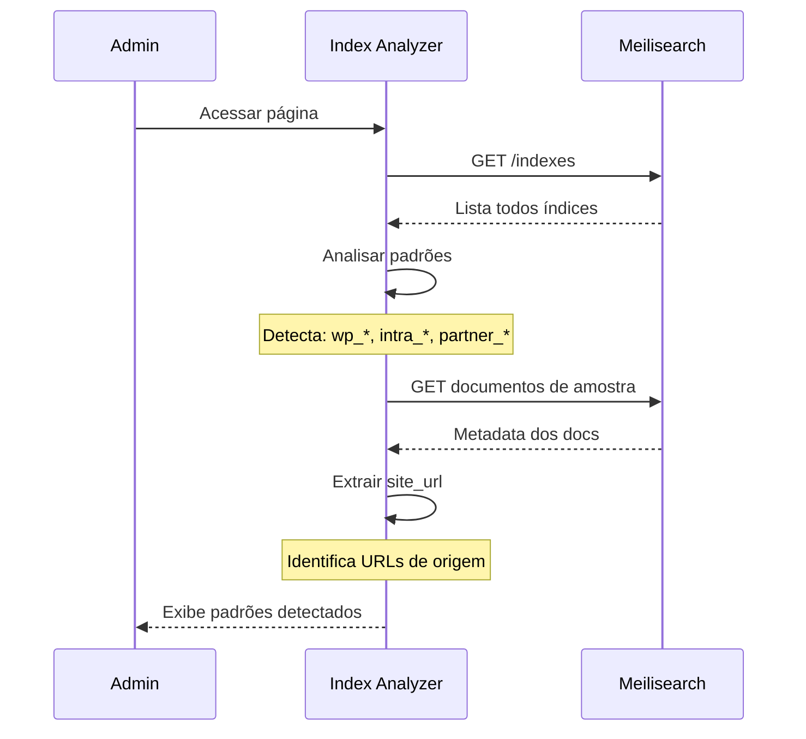

# 🔗 Multi-Pattern Search

Sistema para buscar em múltiplas instalações WordPress que compartilham o mesmo servidor Meilisearch.

## Visão Geral

O Multi-Pattern Search permite que você busque simultaneamente em diferentes redes WordPress que usam o mesmo servidor Meilisearch, mas com prefixos de índice diferentes.

## Cenário de Uso

```
Empresa com múltiplas redes WordPress:

Rede Pública (site.com):
├── wp_1_posts (blog)
├── wp_2_posts (notícias)
└── wp_3_posts (produtos)

Intranet (intranet.site.com):
├── intra_1_posts (documentação)
├── intra_2_posts (wiki)
└── intra_3_posts (procedimentos)

Portal Parceiros (parceiros.site.com):
├── partner_1_posts (conteúdo)
└── partner_2_posts (recursos)
```

Com Multi-Pattern, você pode buscar em todas essas redes de uma vez.

## Index Analyzer

### Detectar Padrões

Acesse: **Network Admin → Meilisearch → Index Analyzer**

O Index Analyzer escaneia o Meilisearch e detecta automaticamente:

1. **Padrões de nomenclatura** (prefixos)
2. **Quantidade de índices** por padrão
3. **URLs de origem** (quando possível)



**Resultado esperado**:

```
┌──────────────┬───────┬──────────────────────────┐
│ Pattern      │ Count │ Network URL              │
├──────────────┼───────┼──────────────────────────┤
│ wp_*         │ 3     │ https://site.com         │
│ intra_*      │ 3     │ https://intranet.site.com│
│ partner_*    │ 2     │ https://parceiros.com    │
└──────────────┴───────┴──────────────────────────┘
```

## Configuração

### 1. Ativar Padrões

Acesse: **Network Admin → Meilisearch → Multi-Pattern Search**

1. Selecione os padrões para incluir
2. Salve configurações

```
Padrões Disponíveis:

☑️ wp_* (https://site.com)
   Incluir rede pública na busca
   
☑️ intra_* (https://intranet.site.com)
   Incluir intranet na busca
   
☐ partner_* (https://parceiros.com)
   Não incluir parceiros
```

### 2. Testar Busca

Na mesma página, use o campo **"Test Search"**:

```
Query: "documentação"
Padrões: wp_*, intra_*

Resultados:
- [wp_1_posts] Como Criar Documentação (5 resultados)
- [intra_1_posts] Manual de Procedimentos (12 resultados)
- Total: 17 resultados de 2 redes
```

## Busca Multi-Pattern

### Via REST API

```bash
curl -X POST "https://site.com/wp-json/meilisearch/v1/multi-search" \
  -H "Content-Type: application/json" \
  -d '{
    "q": "documentação",
    "patterns": ["wp_*", "intra_*"]
  }'
```

**Resposta**:

```json
{
  "success": true,
  "results": [
    {
      "index": "wp_1_posts",
      "hits": [
        {
          "title": "Guia de Documentação",
          "url": "https://site.com/guia-doc"
        }
      ],
      "total": 5
    },
    {
      "index": "intra_1_posts",
      "hits": [
        {
          "title": "Manual de Procedimentos",
          "url": "https://intranet.site.com/manual"
        }
      ],
      "total": 12
    }
  ],
  "total_hits": 17,
  "total_indexes": 6,
  "query": "documentação",
  "time": 0.089
}
```

### Via PHP

```php
$client = new Meilisearch_Client($host, $key);
$searcher = new Meilisearch_Multi_Pattern_Search($client);

$results = $searcher->search_multi_pattern('documentação', [
    'patterns' => ['wp_*', 'intra_*'],
    'limit' => 20
]);
```

## Casos de Uso

### 1. Portal Unificado

Criar um portal único que busca em todas as redes:

```php
// functions.php do portal
add_shortcode('search_all', function($atts) {
    $atts = shortcode_atts([
        'query' => '',
        'patterns' => 'wp_*,intra_*'
    ], $atts);
    
    $patterns = explode(',', $atts['patterns']);
    $searcher = new Meilisearch_Multi_Pattern_Search(
        meilisearch_get_client()
    );
    
    $results = $searcher->search_multi_pattern(
        $atts['query'], 
        ['patterns' => $patterns]
    );
    
    // Renderizar resultados
    ob_start();
    foreach ($results['results'] as $index_results) {
        echo '<h3>' . $index_results['index'] . '</h3>';
        foreach ($index_results['hits'] as $hit) {
            echo '<p><a href="' . $hit['url'] . '">' . $hit['title'] . '</a></p>';
        }
    }
    return ob_get_clean();
});

// Uso: [search_all query="termo" patterns="wp_*,intra_*"]
```

### 2. Busca Federada

Permitir que usuários escolham onde buscar:

```html
<form>
    <input type="search" name="q" placeholder="Buscar...">
    
    <label>
        <input type="checkbox" name="patterns[]" value="wp_*" checked>
        Site Público
    </label>
    
    <label>
        <input type="checkbox" name="patterns[]" value="intra_*">
        Intranet
    </label>
    
    <button type="submit">Buscar</button>
</form>
```

### 3. Dashboard Administrativo

Monitorar todas as redes de um único lugar:

```php
$all_stats = [];
$patterns = ['wp_*', 'intra_*', 'partner_*'];

foreach ($patterns as $pattern) {
    $indexes = meilisearch_get_indexes_by_pattern($pattern);
    $stats = meilisearch_get_stats($indexes);
    $all_stats[$pattern] = $stats;
}

// Exibir estatísticas consolidadas
```

## Filtros e Customização

### Filtrar Padrões Disponíveis

```php
add_filter('meilisearch_available_patterns', function($patterns) {
    // Adicionar padrão customizado
    $patterns[] = [
        'pattern' => 'custom_*',
        'name' => 'Rede Customizada',
        'url' => 'https://custom.site.com'
    ];
    return $patterns;
});
```

### Modificar Resultados Multi-Pattern

```php
add_filter('meilisearch_multi_pattern_results', function($results, $query) {
    // Reordenar por relevância global
    usort($results['results'], function($a, $b) {
        return $b['total'] <=> $a['total'];
    });
    return $results;
}, 10, 2);
```

## Performance

### Otimizações

1. **Limitar padrões ativos**: Menos padrões = busca mais rápida
2. **Cache por padrão**: Cache separado para cada combinação de padrões
3. **Índices específicos**: Se souber quais índices buscar, especifique-os

### Benchmarks

| Padrões | Índices | Tempo Médio |
|---------|---------|-------------|
| 1 padrão | 3 índices | ~50ms |
| 2 padrões | 6 índices | ~100ms |
| 3 padrões | 9 índices | ~150ms |

## Segurança

### Controle de Acesso

```php
// Permitir apenas admins buscar em intranet
add_filter('meilisearch_allowed_patterns', function($patterns, $user_id) {
    if (!user_can($user_id, 'manage_network')) {
        // Remover padrão da intranet para usuários normais
        $patterns = array_filter($patterns, function($p) {
            return $p !== 'intra_*';
        });
    }
    return $patterns;
}, 10, 2);
```

## Troubleshooting

### Padrão não detectado

**Causas**:
- Nenhum índice com aquele prefixo
- Conexão com Meilisearch falhou
- Índices sem metadata `site_url`

**Solução**:

```bash
# Verificar índices no Meilisearch
curl "http://localhost:7700/indexes" \
  -H "Authorization: Bearer MASTER_KEY"

# Verificar se tem site_url nos documentos
curl "http://localhost:7700/indexes/wp_1_posts/documents/1" \
  -H "Authorization: Bearer MASTER_KEY"
```

### Busca multi-pattern lenta

**Otimizações**:

```php
// Reduzir limite por índice
$results = $searcher->search_multi_pattern('termo', [
    'patterns' => ['wp_*', 'intra_*'],
    'limit_per_index' => 5 // ao invés de 10
]);

// Ou buscar em paralelo (com ReactPHP)
$results = $searcher->search_multi_pattern_async('termo', [
    'patterns' => ['wp_*', 'intra_*']
]);
```

## Próximos Passos

- [Sistema de Busca](search.md)
- [Indexação](indexing.md)
- [API Reference](../api-reference.md)
