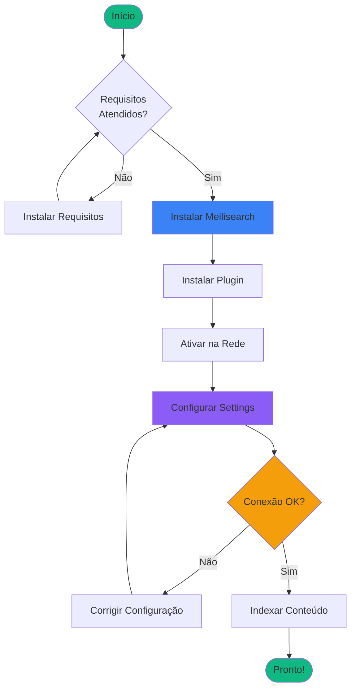
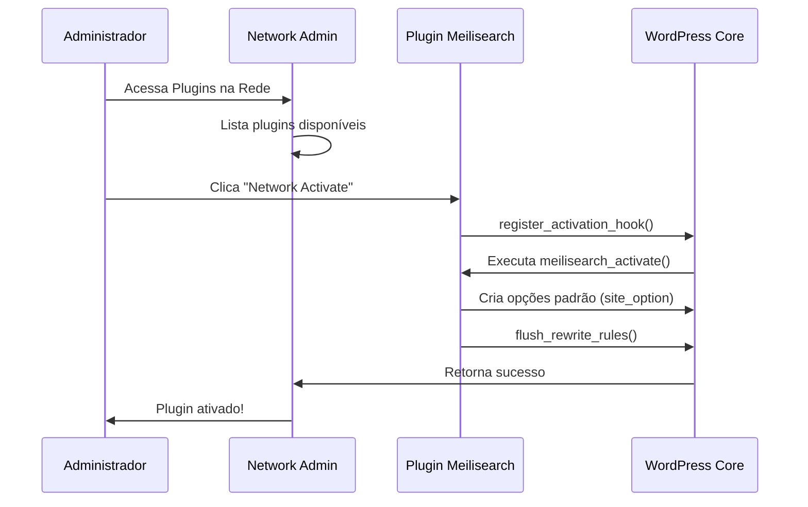

# 🚀 Guia de Instalação

Este guia irá ajudá-lo a instalar e configurar o plugin Meilisearch Network Search no seu WordPress Multisite.

## Fluxo de Instalação



## Pré-requisitos

### 1. Verificar Requisitos do Sistema

Antes de instalar, certifique-se de que seu ambiente atende aos requisitos:

| Componente | Requisito | Como Verificar |
|------------|-----------|----------------|
| WordPress | 6.0+ | Painel → Atualizações |
| Multisite | Obrigatório | `is_multisite()` deve retornar `true` |
| PHP | 8.1+ | `phpinfo()` ou `php -v` |
| Composer | Qualquer versão | `composer --version` |
| Meilisearch | 1.0+ | Próxima seção |

#### Verificar PHP 8.1+

```bash
# Via terminal
php -v

# Deve mostrar algo como:
# PHP 8.1.x ou PHP 8.2.x ou PHP 8.3.x
```

Se sua versão PHP for menor que 8.1, você precisará atualizá-la.

#### Verificar WordPress Multisite

No `wp-config.php`, você deve ter:

```php
define('WP_ALLOW_MULTISITE', true);
// ou
define('MULTISITE', true);
```

### 2. Instalar Meilisearch Server

O plugin requer um servidor Meilisearch auto-hospedado. Você tem várias opções:

#### Opção A: Docker (Recomendado)

```bash
# Criar diretório para dados
mkdir meili_data

# Executar container Meilisearch
docker run -d \
  --name meilisearch \
  -p 7700:7700 \
  -e MEILI_MASTER_KEY=SuaChaveMestra123 \
  -v $(pwd)/meili_data:/meili_data \
  getmeili/meilisearch:latest
```

**Importante**: Guarde a `MEILI_MASTER_KEY` - você precisará dela para configurar o plugin!

#### Opção B: Instalação Direta

```bash
# Linux/Mac
curl -L https://install.meilisearch.com | sh

# Executar
./meilisearch --master-key="SuaChaveMestra123"
```

#### Opção C: Cloud (Meilisearch Cloud)

Crie uma conta em [https://cloud.meilisearch.com/](https://cloud.meilisearch.com/) e obtenha:
- URL do host (ex: `https://ms-xxxxx.meilisearch.io`)
- Master Key

#### Verificar Instalação do Meilisearch

```bash
# Testar se Meilisearch está rodando
curl http://localhost:7700/health

# Resposta esperada:
# {"status":"available"}
```

## Instalação do Plugin

### Passo 1: Download do Plugin

#### Via Git

```bash
cd wp-content/plugins/
git clone https://github.com/joaovjo/meilisearch.git
cd meilisearch
```

#### Via ZIP

1. Baixe o arquivo ZIP do [repositório](https://github.com/joaovjo/meilisearch/archive/refs/heads/main.zip)
2. Extraia para `wp-content/plugins/meilisearch/`

### Passo 2: Instalar Dependências

O plugin usa Composer para gerenciar dependências PHP:

```bash
# Entrar no diretório do plugin
cd wp-content/plugins/meilisearch

# Instalar dependências (produção)
composer install --no-dev --optimize-autoloader

# OU para desenvolvimento (inclui ferramentas de teste)
composer install
```

**Dependências principais instaladas**:
- `meilisearch/meilisearch-php` - SDK oficial do Meilisearch
- `guzzlehttp/guzzle` - Cliente HTTP
- `react/*` - Bibliotecas ReactPHP para operações assíncronas

### Passo 3: Ativar na Rede



#### Via Interface Web

1. Acesse **Network Admin** → **Plugins**
2. Localize "Meilisearch Network Search"
3. Clique em **"Network Activate"** (não ative individualmente!)
4. Aguarde a mensagem de confirmação

#### Via WP-CLI

```bash
# Ativar na rede
wp plugin activate meilisearch --network

# Verificar status
wp plugin list --network
```

**⚠️ Importante**: Este plugin **DEVE** ser ativado na rede. Ativação individual em sites não é suportada.

### Passo 4: Verificar Instalação

Após ativação, verifique se os menus foram criados:

1. Acesse **Network Admin** → **Settings**
2. Deve haver um submenu **"Meilisearch"**
3. Acesse **Network Admin** → **Meilisearch** (menu principal)
4. Deve mostrar o Dashboard

Se os menus não aparecerem:
- Verifique se o plugin está ativado na rede
- Verifique o `debug.log` para erros
- Verifique se as dependências do Composer foram instaladas

## Configuração Inicial

### Passo 5: Configurar Conexão

1. Acesse **Network Admin** → **Settings** → **Meilisearch**
2. Preencha os campos:

#### Campos de Configuração

| Campo | Descrição | Exemplo |
|-------|-----------|---------|
| **Meilisearch Host** | URL do servidor Meilisearch | `http://localhost:7700` |
| **Master Key** | Chave mestra configurada no servidor | `SuaChaveMestra123` |
| **Habilitar Plugin** | Ativar substituição de busca | ☑️ Marcado |
| **Post Types** | Tipos de conteúdo para indexar | `post`, `page` |

#### Exemplo de Configuração

```
Host: http://localhost:7700
Master Key: SuaChaveMestra123
Habilitado: ✓
Post Types: post, page
```

3. Clique em **"Test Connection"** para validar
4. Se bem-sucedido, clique em **"Save Changes"**

### Passo 6: Indexar Conteúdo

Após salvar as configurações, você precisa indexar o conteúdo existente.

#### Via WP-CLI (Recomendado para redes grandes)

```bash
# Indexar todos os sites da rede
wp meilisearch index --network

# Indexar site específico
wp meilisearch index --url=site1.example.com

# Ver progresso detalhado
wp meilisearch index --network --debug
```

#### Via Interface Admin

1. Acesse **Network Admin** → **Meilisearch** → **Dashboard**
2. Clique em **"Reindex All Sites"**
3. Aguarde a conclusão (pode demorar para redes grandes)

### Passo 7: Testar Busca

1. Acesse qualquer site da rede
2. Use o campo de busca
3. Digite um termo existente no seu conteúdo
4. Os resultados devem aparecer instantaneamente
5. O autocomplete deve sugerir resultados enquanto digita

## Configurações Avançadas

### Configuração de Ambiente Docker

Se você está executando WordPress em Docker, adicione Meilisearch ao `docker-compose.yml`:

```yaml
services:
  wordpress:
    # ... configuração existente ...
    
  meilisearch:
    image: getmeili/meilisearch:latest
    container_name: meilisearch
    ports:
      - "7700:7700"
    environment:
      MEILI_MASTER_KEY: ${MEILI_MASTER_KEY}
      MEILI_ENV: production
    volumes:
      - meili_data:/meili_data
    networks:
      - wordpress_network

volumes:
  meili_data:

networks:
  wordpress_network:
```

No plugin, use o host: `http://meilisearch:7700`

### Ajustes de Performance

#### PHP Memory Limit

Para indexação de redes grandes, aumente o limite de memória no `php.ini`:

```ini
memory_limit = 512M
max_execution_time = 300
```

#### Meilisearch Resources

Para produção, aloque recursos adequados:

```bash
docker run -d \
  --name meilisearch \
  --memory="2g" \
  --cpus="2" \
  -p 7700:7700 \
  -e MEILI_MASTER_KEY=SuaChave \
  getmeili/meilisearch:latest
```

## Verificação Pós-Instalação

Use esta checklist para confirmar que tudo está funcionando:

- [ ] Plugin ativado na rede
- [ ] Meilisearch rodando e acessível
- [ ] Configurações salvas sem erro
- [ ] Teste de conexão bem-sucedido
- [ ] Conteúdo indexado (ver Dashboard → Metrics)
- [ ] Busca no frontend retorna resultados
- [ ] Autocomplete aparece ao digitar
- [ ] Sem erros no `debug.log`

## Próximos Passos

Agora que o plugin está instalado:

1. 📖 Leia o [Guia do Administrador](usage/admin-guide.md) para gerenciamento diário
2. 🔧 Explore as [Opções de Configuração](configuration.md) avançadas
3. 📊 Monitore o desempenho em **Meilisearch** → **Metrics**
4. 🔍 Configure [Multi-Pattern Search](features/multi-pattern.md) se tiver múltiplas redes

## Problemas Comuns

### "This plugin requires WordPress Multisite"

**Problema**: Plugin desativado automaticamente após ativação.

**Solução**: Configure WordPress Multisite. Veja [WordPress Multisite Documentation](https://wordpress.org/support/article/create-a-network/).

### "Connection failed"

**Problema**: Plugin não consegue conectar ao Meilisearch.

**Solução**:
1. Verifique se Meilisearch está rodando: `curl http://localhost:7700/health`
2. Confirme o host no plugin (use `http://` na URL)
3. Verifique firewall/portas
4. Teste com `master_key` vazia primeiro

### Composer não encontrado

**Problema**: `composer: command not found`

**Solução**: Instale Composer:

```bash
# Download
curl -sS https://getcomposer.org/installer | php

# Mover para PATH
sudo mv composer.phar /usr/local/bin/composer

# Verificar
composer --version
```

### Mais soluções

Veja o [Guia de Troubleshooting](troubleshooting.md) completo para mais problemas e soluções.

---

**Instalação concluída?** Continue para [Configuração](configuration.md) para ajustar opções avançadas.
