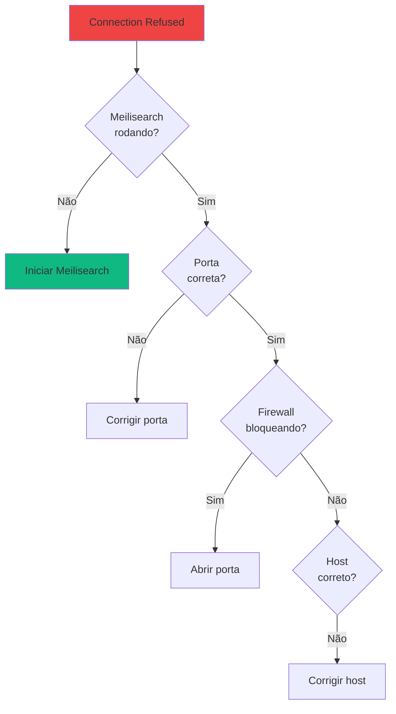
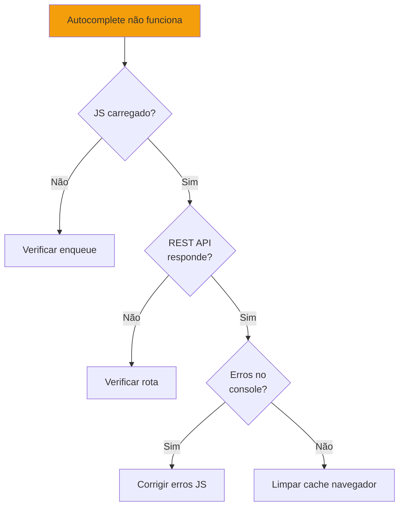

# 🔧 Troubleshooting

Guia de solução de problemas comuns do plugin Meilisearch Network Search.

## Problemas de Conexão

### "Connection refused"

**Sintoma**: Plugin não consegue conectar ao Meilisearch.

**Causas possíveis**:



**Soluções**:

1. **Verificar se Meilisearch está rodando**:
```bash
# Verificar container Docker
docker ps | grep meilisearch

# Ou testar diretamente
curl http://localhost:7700/health
```

2. **Verificar porta**:
```bash
# Verificar qual porta está configurada
grep "MEILISEARCH.*HOST" wp-config.php

# Padrão: 7700
```

3. **Verificar firewall**:
```bash
# Linux: permitir porta 7700
sudo ufw allow 7700/tcp

# Docker: expor porta no docker-compose.yml
ports:
  - "7700:7700"
```

### "401 Unauthorized"

**Sintoma**: Erro de autenticação.

**Causa**: Master key incorreta.

**Solução**:

1. Verificar master key do Meilisearch:
```bash
# Ver variável de ambiente
docker exec meilisearch env | grep MEILI_MASTER_KEY
```

2. Atualizar no plugin:
   - Network Admin → Settings → Meilisearch
   - Corrigir campo "Master Key"
   - Clicar "Test Connection"

### "Timeout"

**Sintoma**: Requisição demora muito e falha.

**Causas**:
- Meilisearch sobrecarregado
- Rede lenta
- Hardware insuficiente

**Soluções**:

1. **Aumentar timeout no PHP**:
```ini
; php.ini
max_execution_time = 300
```

2. **Aumentar recursos do Meilisearch**:
```bash
docker update meilisearch --memory="2g" --cpus="2"
```

3. **Verificar latência de rede**:
```bash
ping -c 10 localhost
```

## Problemas de Indexação

### Posts não aparecem nos resultados

**Diagnóstico**:

```bash
# 1. Verificar se post foi indexado
wp meilisearch search "titulo-do-post" --debug

# 2. Ver estatísticas do índice
wp meilisearch stats --blog_id=1

# 3. Verificar logs
grep "Meilisearch.*index" wp-content/debug.log
```

**Checklist**:

- [ ] Post está publicado (status = `publish`)
- [ ] Post type está configurado para indexar
- [ ] Plugin está habilitado
- [ ] Conexão com Meilisearch OK
- [ ] Índice existe para o site

**Solução**:

```bash
# Reindexar site específico
wp meilisearch reindex --blog_id=1

# Ou reindexar tudo
wp meilisearch reindex --network
```

### "Failed to add documents"

**Sintoma**: Erro ao indexar documentos.

**Causas**:
- Documento muito grande (>100MB)
- Campos inválidos
- Timeout

**Soluções**:

1. **Reduzir tamanho do documento**:
```php
add_filter('meilisearch_document_fields', function($fields, $post) {
    // Limitar tamanho do content
    $fields['content'] = mb_substr($fields['content'], 0, 50000);
    return $fields;
}, 10, 2);
```

2. **Aumentar batch size**:
```php
add_filter('meilisearch_batch_size', function($size) {
    return 50; // Padrão: 100
});
```

### Sincronização lenta

**Sintoma**: Demora muito para indexar.

**Análise de performance**:

```bash
# Medir tempo de indexação
time wp meilisearch index --blog_id=1
```

**Otimizações**:

1. **Usar WP-CLI em vez de interface web**
2. **Aumentar recursos do servidor**
3. **Rodar indexação em horário de baixo tráfego**
4. **Usar Fiber para concorrência** (já implementado)

## Problemas de Busca

### Resultados irrelevantes

**Sintoma**: Busca retorna posts não relacionados.

**Ajustes de relevância**:

```php
add_filter('meilisearch_index_settings', function($settings) {
    // Priorizar título
    $settings['searchableAttributes'] = [
        'title',
        'excerpt',
        'content'
    ];
    
    // Reduzir typo tolerance
    $settings['typoTolerance'] = [
        'enabled' => true,
        'minWordSizeForTypos' => [
            'oneTypo' => 6,
            'twoTypos' => 10
        ]
    ];
    
    return $settings;
});
```

### Busca não encontra posts recentes

**Sintoma**: Posts novos não aparecem.

**Causas**:
- Cache de transients
- Hook `save_post` não disparou
- Erro silencioso na indexação

**Soluções**:

```bash
# 1. Limpar cache
wp transient delete-all

# 2. Reindexar
wp meilisearch reindex --blog_id=1

# 3. Indexar post específico
wp meilisearch index_post <post_id> --blog_id=1
```

### Autocomplete não funciona

**Diagnóstico**:



**Verificações**:

1. **JavaScript carregado**:
```bash
curl -s https://seusite.com | grep "autocomplete.js"
```

2. **REST API funciona**:
```bash
curl "https://seusite.com/wp-json/meilisearch/v1/autocomplete?q=test"
```

3. **Erros no console do navegador**:
   - Abrir DevTools (F12)
   - Ir em Console
   - Digitar no campo de busca
   - Ver erros em vermelho

**Soluções**:

```php
// Forçar enqueue do script
add_action('wp_enqueue_scripts', function() {
    if (!wp_script_is('meilisearch-autocomplete', 'enqueued')) {
        wp_enqueue_script('meilisearch-autocomplete');
        wp_enqueue_style('meilisearch-autocomplete');
    }
}, 999);
```

## Problemas de Performance

### Busca lenta

**Benchmark**:

```bash
# Medir tempo de busca
time wp meilisearch search "termo" --blog_id=1
```

**Análise**:

| Tempo | Status | Ação |
|-------|--------|------|
| <100ms | ✅ Ótimo | Nenhuma |
| 100-500ms | ⚠️ Aceitável | Monitorar |
| >500ms | ❌ Lento | Otimizar |

**Otimizações**:

1. **Reduzir campos retornados**:
```php
add_filter('meilisearch_search_params', function($params) {
    $params['attributesToRetrieve'] = ['id', 'title', 'url'];
    return $params;
});
```

2. **Aumentar recursos do Meilisearch**:
```yaml
# docker-compose.yml
services:
  meilisearch:
    deploy:
      resources:
        limits:
          memory: 2G
          cpus: '2'
```

3. **Usar cache de transients**:
```php
// Cache está habilitado por padrão (5 min)
// Aumentar TTL se necessário
add_filter('meilisearch_cache_ttl', function($ttl) {
    return 600; // 10 minutos
});
```

### Alto uso de memória

**Sintoma**: PHP memory exhausted.

**Solução**:

```ini
; php.ini
memory_limit = 512M
```

Ou via `wp-config.php`:
```php
define('WP_MEMORY_LIMIT', '512M');
define('WP_MAX_MEMORY_LIMIT', '512M');
```

## Problemas de Instalação

### "This plugin requires WordPress Multisite"

**Causa**: WordPress não está em modo multisite.

**Solução**: Configurar multisite:

1. Editar `wp-config.php`:
```php
define('WP_ALLOW_MULTISITE', true);
```

2. Acessar Network Setup:
   - Tools → Network Setup
   - Seguir instruções

3. Adicionar ao `wp-config.php`:
```php
define('MULTISITE', true);
define('SUBDOMAIN_INSTALL', false);
define('DOMAIN_CURRENT_SITE', 'example.com');
define('PATH_CURRENT_SITE', '/');
define('SITE_ID_CURRENT_SITE', 1);
define('BLOG_ID_CURRENT_SITE', 1);
```

### "Composer dependencies not found"

**Sintoma**: Erro ao ativar plugin.

**Causa**: Dependências não instaladas.

**Solução**:

```bash
cd wp-content/plugins/meilisearch
composer install --no-dev
```

### Plugin não aparece para ativar

**Possíveis causas**:

1. **Pasta no local errado**:
```bash
# Correto: wp-content/plugins/meilisearch/meilisearch.php
# Incorreto: wp-content/plugins/meilisearch-main/meilisearch.php
```

2. **Permissões incorretas**:
```bash
sudo chown -R www-data:www-data wp-content/plugins/meilisearch
sudo chmod -R 755 wp-content/plugins/meilisearch
```

3. **Erro de sintaxe no plugin**:
```bash
php -l wp-content/plugins/meilisearch/meilisearch.php
```

## Problemas de Compatibilidade

### Conflito com outros plugins de busca

**Sintomas**:
- Duas barras de busca
- Resultados duplicados
- Busca não funciona

**Solução**: Desativar outros plugins de busca:
- SearchWP
- Relevanssi
- ElasticPress
- FacetWP

### Tema não mostra resultados

**Causa**: Tema customizado não usa `WP_Query` padrão.

**Solução**: Criar template personalizado:

```php
// searchform.php no tema
<form role="search" method="get" action="<?php echo esc_url(home_url('/')); ?>">
    <input type="search" name="s" value="<?php echo get_search_query(); ?>">
    <button type="submit">Buscar</button>
</form>
```

### PHP 8.1+ não disponível

**Sintoma**: Plugin requer PHP 8.1+.

**Soluções**:

1. **Atualizar PHP no servidor**:
```bash
# Ubuntu/Debian
sudo apt install php8.2

# CentOS/RHEL
sudo yum install php82
```

2. **Docker**: Usar imagem com PHP 8.2+:
```dockerfile
FROM wordpress:php8.2-apache
```

3. **Hosting compartilhado**: Contatar suporte para atualizar PHP

## Logs e Debug

### Habilitar Debug Mode

```php
// wp-config.php
define('WP_DEBUG', true);
define('WP_DEBUG_LOG', true);
define('WP_DEBUG_DISPLAY', false);
define('SCRIPT_DEBUG', true);
```

### Ver Logs

```bash
# Logs do WordPress
tail -f wp-content/debug.log

# Logs do Meilisearch (Docker)
docker logs -f meilisearch

# Filtrar logs do plugin
grep "Meilisearch" wp-content/debug.log
```

### Logs Úteis

```php
// Adicionar log customizado
error_log('Meilisearch: ' . print_r($data, true));

// Log de performance
error_log('Search took: ' . (microtime(true) - $start) . 's');
```

## Ferramentas de Diagnóstico

### Health Check

```bash
# Via WP-CLI
wp meilisearch health

# Manualmente
curl http://localhost:7700/health
```

### Ver Configuração

```bash
# Ver todas as configurações
wp option get meilisearch_settings --format=json
```

### Testar Busca

```bash
# Busca com debug
wp meilisearch search "termo" --debug --network
```

## Suporte Adicional

### Informações para Reportar Bug

Ao reportar um problema, inclua:

```
1. Versão do plugin: X.X.X
2. Versão do WordPress: X.X.X
3. Versão do PHP: X.X.X
4. Versão do Meilisearch: X.X.X
5. Erro exato (copiar e colar)
6. Steps to reproduce
7. Logs relevantes
```

### Onde Buscar Ajuda

- 📖 Documentação: [docs/plugin/](./README.md)
- 🐛 Issues: [GitHub Issues](https://github.com/joaovjo/meilisearch/issues)
- 💬 Discussões: [GitHub Discussions](https://github.com/joaovjo/meilisearch/discussions)
- 📧 Email: suporte@example.com

---

**Problema não resolvido?** Abra um [issue no GitHub](https://github.com/joaovjo/meilisearch/issues/new) com detalhes.
