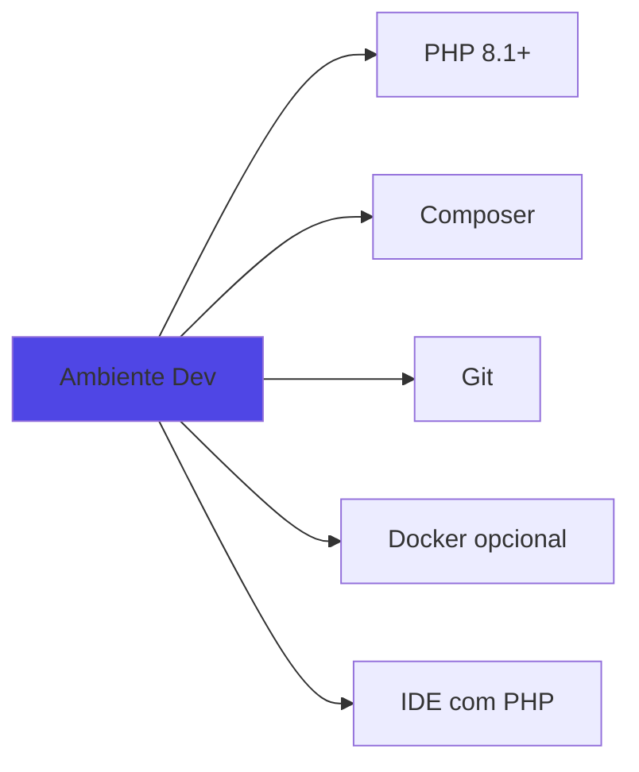

# 👨‍💻 Guia do Desenvolvedor

Guia para desenvolvedores que desejam contribuir, customizar ou estender o plugin Meilisearch.

## Setup de Desenvolvimento

### Requisitos



### Clonar Repositório

```bash
# Clone
git clone https://github.com/joaovjo/meilisearch.git
cd meilisearch

# Instalar dependências
composer install

# Configurar Git hooks (opcional)
git config core.hooksPath .githooks
```

### Configurar Ambiente

```bash
# Copiar .env de exemplo
cp .env.example .env

# Editar variáveis
MEILISEARCH_HOST=http://localhost:7700
MEILISEARCH_MASTER_KEY=dev-key-123
```

### Executar Testes

```bash
# Setup WordPress test environment (primeira vez)
bash bin/install-wp-tests.sh wordpress_test root '' localhost latest

# Executar PHPUnit
composer test

# Ou diretamente
vendor/bin/phpunit
```

## Estrutura do Código

```
meilisearch/
├── meilisearch.php           # Bootstrap
├── includes/                 # Core classes
│   ├── class-client.php
│   ├── class-indexer.php
│   ├── class-searcher.php
│   ├── class-autocomplete.php
│   └── class-search-api.php
├── admin/                    # Network admin
│   ├── class-dashboard.php
│   ├── class-network-settings.php
│   ├── class-metrics.php
│   ├── class-index-analyzer.php
│   └── class-multi-pattern-search.php
├── public/                   # Frontend
│   └── class-search-override.php
├── assets/                   # JS/CSS
│   ├── js/autocomplete.js
│   └── css/autocomplete.css
├── tests/                    # PHPUnit tests
└── vendor/                   # Dependencies
```

## Padrões de Código

### WordPress Coding Standards

```bash
# Verificar padrões
composer phpcs

# Auto-fix quando possível
composer phpcbf
```

### Namespacing

Não usado atualmente (WordPress style). Classes usam prefixo `Meilisearch_`.

### Nomenclatura

```php
// Classes: PascalCase com prefixo
class Meilisearch_Client {}

// Funções: snake_case com prefixo
function meilisearch_init() {}

// Hooks: snake_case com prefixo
do_action('meilisearch_after_index');

// Constantes: UPPER_CASE com prefixo
define('MEILISEARCH_VERSION', '1.0.0');
```

### Documentação (phpDocumentor)

```php
/**
 * Indexa um post no Meilisearch.
 *
 * @param int $post_id ID do post.
 * @param int $blog_id ID do site.
 * @return bool True se sucesso, false se falha.
 * @throws Exception Se conexão falhar.
 * @since 1.0.0
 */
public function index_post($post_id, $blog_id) {
    // ...
}
```

## Adicionando Features

### 1. Nova Feature: Filtros Facetados

#### Passo 1: Configurar Facets no Índice

```php
// includes/class-indexer.php
add_filter('meilisearch_index_settings', function($settings) {
    $settings['filterableAttributes'][] = 'categories';
    $settings['filterableAttributes'][] = 'tags';
    return $settings;
});
```

#### Passo 2: Adicionar Parâmetro de Busca

```php
// includes/class-searcher.php
public function search_with_facets($query, $facets = []) {
    $params = [
        'q' => $query,
        'facets' => $facets
    ];
    
    return $this->client->get_index($index_name)->search('', $params);
}
```

#### Passo 3: Criar Endpoint REST

```php
// includes/class-search-api.php
add_action('rest_api_init', function() {
    register_rest_route('meilisearch/v1', '/facets', [
        'methods' => 'GET',
        'callback' => [$this, 'get_facets'],
        'permission_callback' => '__return_true'
    ]);
});

public function get_facets($request) {
    $query = $request->get_param('q');
    $facets = ['categories', 'tags'];
    
    $results = $this->searcher->search_with_facets($query, $facets);
    
    return new WP_REST_Response([
        'facets' => $results['facetDistribution']
    ]);
}
```

#### Passo 4: Interface no Frontend

```javascript
// assets/js/facets.js
async function loadFacets(query) {
    const response = await fetch(
        `/wp-json/meilisearch/v1/facets?q=${query}`
    );
    const data = await response.json();
    
    renderFacets(data.facets);
}
```

### 2. Nova Feature: Busca por Voz

```javascript
// assets/js/voice-search.js
const searchInput = document.querySelector('[data-meilisearch-autocomplete]');
const voiceBtn = document.createElement('button');
voiceBtn.innerHTML = '🎤';

voiceBtn.addEventListener('click', () => {
    if (!('webkitSpeechRecognition' in window)) {
        alert('Navegador não suporta reconhecimento de voz');
        return;
    }
    
    const recognition = new webkitSpeechRecognition();
    recognition.lang = 'pt-BR';
    
    recognition.onresult = (event) => {
        const transcript = event.results[0][0].transcript;
        searchInput.value = transcript;
        searchInput.dispatchEvent(new Event('input'));
    };
    
    recognition.start();
});

searchInput.parentElement.appendChild(voiceBtn);
```

## Testando

### Estrutura de Testes

```php
// tests/test-indexer.php
class Test_Meilisearch_Indexer extends WP_UnitTestCase {
    private $client;
    private $indexer;
    
    public function setUp(): void {
        parent::setUp();
        
        $this->client = $this->createMock(Meilisearch_Client::class);
        $this->indexer = new Meilisearch_Indexer($this->client);
    }
    
    public function test_index_post() {
        $post_id = $this->factory->post->create([
            'post_title' => 'Test Post'
        ]);
        
        $this->client
            ->expects($this->once())
            ->method('get_index')
            ->willReturn(/* mock index */);
        
        $result = $this->indexer->index_post($post_id, 1);
        
        $this->assertTrue($result);
    }
}
```

### Executar Testes Específicos

```bash
# Testar classe específica
vendor/bin/phpunit tests/test-indexer.php

# Testar método específico
vendor/bin/phpunit --filter test_index_post

# Com coverage
vendor/bin/phpunit --coverage-html coverage/
```

## Debugging

### Debug Mode

```php
// wp-config.php
define('WP_DEBUG', true);
define('WP_DEBUG_LOG', true);
define('WP_DEBUG_DISPLAY', false);
define('SCRIPT_DEBUG', true);
define('SAVEQUERIES', true);
```

### Logs Úteis

```php
// Log simples
error_log('Meilisearch: Indexing post ' . $post_id);

// Log com dados
error_log('Meilisearch data: ' . print_r($data, true));

// Log de performance
$start = microtime(true);
// ... código ...
$time = microtime(true) - $start;
error_log("Meilisearch: Operation took {$time}s");
```

### XDebug

```ini
; php.ini
zend_extension=xdebug.so
xdebug.mode=debug
xdebug.start_with_request=yes
xdebug.client_port=9003
```

VSCode `.vscode/launch.json`:

```json
{
    "version": "0.2.0",
    "configurations": [
        {
            "name": "Listen for XDebug",
            "type": "php",
            "request": "launch",
            "port": 9003,
            "pathMappings": {
                "/var/www/html": "${workspaceFolder}"
            }
        }
    ]
}
```

## Contribuindo

### Workflow


### Criar Branch

```bash
# Feature
git checkout -b feature/nome-da-feature

# Bug fix
git checkout -b fix/descricao-do-bug

# Docs
git checkout -b docs/melhoria-docs
```

### Commit Messages

Seguir [Conventional Commits](https://www.conventionalcommits.org/):

```bash
# Feature
git commit -m "feat: adiciona busca por voz"

# Bug fix
git commit -m "fix: corrige erro de indexação em posts draft"

# Docs
git commit -m "docs: atualiza README com novos exemplos"

# Refactor
git commit -m "refactor: melhora performance do indexer"

# Tests
git commit -m "test: adiciona testes para searcher"
```

### Pull Request

1. Atualizar branch com main:
```bash
git fetch upstream
git rebase upstream/main
```

2. Executar checklist:
- [ ] Código segue WordPress Coding Standards
- [ ] Testes adicionados e passando
- [ ] Documentação atualizada
- [ ] Changelog atualizado
- [ ] Sem conflitos com main

3. Abrir PR com template:

```markdown
## Descrição
Breve descrição da mudança.

## Tipo de Mudança
- [ ] Bug fix
- [ ] Nova feature
- [ ] Breaking change
- [ ] Documentação

## Como Testar
1. Passo 1
2. Passo 2
3. ...

## Checklist
- [ ] Testes passando
- [ ] Docs atualizadas
- [ ] Coding standards OK
```

## Deployment

### Versioning

```bash
# Atualizar versão
# Em meilisearch.php:
# * Version: 1.1.0

# Em README.md, changelog, etc.

# Commit
git commit -m "chore: bump version to 1.1.0"

# Tag
git tag -a v1.1.0 -m "Release v1.1.0"
git push origin v1.1.0
```

### Build para Produção

```bash
# Instalar apenas dependências de produção
composer install --no-dev --optimize-autoloader

# Gerar .pot para traduções
composer makepot

# Criar ZIP
zip -r meilisearch-v1.1.0.zip . \
    -x "*.git*" \
    -x "*node_modules*" \
    -x "*tests*" \
    -x "*.env*"
```

## Recursos para Desenvolvedores

### Documentação

- [WordPress Plugin Handbook](https://developer.wordpress.org/plugins/)
- [Meilisearch PHP SDK](https://github.com/meilisearch/meilisearch-php)
- [ReactPHP](https://reactphp.org/)
- [PHP Fibers](https://www.php.net/manual/en/class.fiber.php)

### Ferramentas

- [WordPress Plugin Boilerplate](https://wppb.me/)
- [Query Monitor](https://wordpress.org/plugins/query-monitor/)
- [Debug Bar](https://wordpress.org/plugins/debug-bar/)

### Comunidade

- GitHub Discussions
- WordPress Slack (#core-multisite)
- Meilisearch Discord

---

**Pronto para contribuir?** Veja [issues abertas](https://github.com/joaovjo/meilisearch/issues) para começar!
